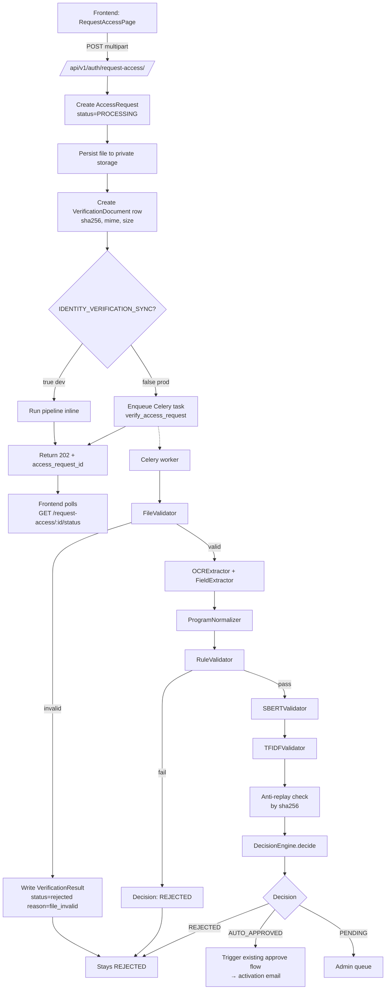
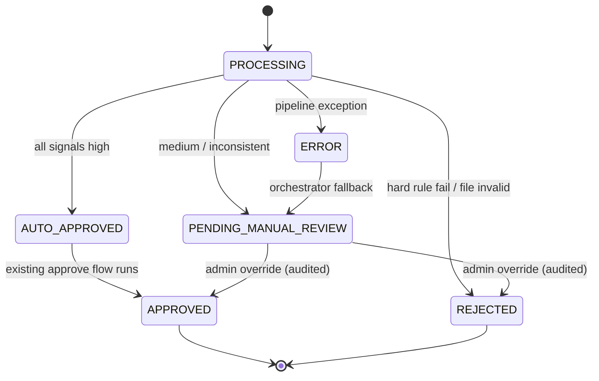

# AI-Assisted Identity Verification — Design

## Overview

This feature replaces the free-text `justification` field on the THESYS+ Request Access form with an uploaded **Student ID** or **Certificate of Registration (COR)**. Each upload is run through an automated verification pipeline (file validation → OCR → rule-based validation → SBERT semantic similarity → TF-IDF keyword overlap → decision engine) that produces one of three terminal states:

- **AUTO_APPROVED** — all signals high; account is approved automatically and the existing activation-email flow runs.
- **PENDING_MANUAL_REVIEW** — medium/inconsistent confidence; goes to admin queue with all extracted artifacts visible.
- **REJECTED** — hard rule failure or unrelated/fake document.

### Scope

- **In scope:** Student ID / COR verification (PNG, JPG, JPEG, PDF), OCR + rule + SBERT + TF-IDF pipeline, decision engine, admin review endpoints, frontend form redesign, retention purge job, anti-replay detection.
- **Out of scope:** Thesis DOCX upload (extensibility hooks only), additional institutions, websocket status streaming, LLM-based extraction, liveness / face-match against ID photo.

### Non-goals

- Do not rewrite or modify the working authentication module (Wave A1–A12).
- Do not change the existing admin approve/reject endpoints. The new pipeline writes the same `AccessRequest.status` values those endpoints already operate on, plus two new ones.
- Existing `pending` access requests are **not** migrated. They remain on the legacy justification flow and continue to be reviewed manually.

### Locked Decisions (from inline review)

| # | Decision |
|---|----------|
| 1 | Retention: 90 days after AUTO_APPROVED, 30 days after REJECTED |
| 2 | Documents are **purged** after retention (file deleted, audit row kept) |
| 3 | Anti-replay: same hash across different emails → **PENDING_MANUAL_REVIEW** (not auto-reject) |
| 4 | SBERT model: `sentence-transformers/all-MiniLM-L6-v2` |
| 5 | Frontend uses **polling** for decision status, not websocket |
| 6 | Program aliases are normalized (BSIS / BS-IS / BS Information Systems / Bachelor of Science in Information Systems → "BS Information System"; equivalent for BSIT, BSCS, ACT) |
| 7 | Existing pending requests **stay on the old flow**; only new submissions hit the new pipeline |

---

## Architecture

### 1.1 Architecture Diagram



### 1.2 Component Breakdown

A **new Django app** `identity_verification` is introduced. It does **not** modify `access_requests` beyond an additive schema migration. Rationale: ML models, OCR binaries, and file storage are heavy concerns with their own dependencies, lifecycle, and feature-flag needs. Isolation lets us swap implementations and ship gradually.

| Component | Responsibility |
|-----------|----------------|
| `FileValidator` | Magic-byte + MIME + size validation. Re-encode images via Pillow to drop EXIF. Strip JS/embedded files from PDFs. |
| `OCRExtractor` | Tesseract wrapper. PDFs go through `pdf2image` first. Returns raw text + per-field confidence. |
| `FieldExtractor` | Regex/heuristic post-processor. Maps OCR text → `ExtractedFields`. |
| `ProgramNormalizer` | Alias map → canonical program name. Used by `FieldExtractor` and `RuleValidator`. |
| `RuleValidator` | Hard institution/college/program checks. Returns pass/fail with structured reasons. |
| `SBERTValidator` | Cosine similarity between OCR fields and precomputed canonical embeddings. |
| `TFIDFValidator` | Keyword overlap between raw OCR text and canonical corpus. |
| `DecisionEngine` | Pure function. `(rule, sbert, tfidf, ocr, anti_replay) → Decision`. |
| `VerificationOrchestrator` | Celery task `verify_access_request(id)`. Idempotent. Handles retries and writes the single `VerificationResult` row. |
| `AdminReviewService` | Read-only views over verification artifacts (extracted fields, OCR text, scores, signed document URL). |
| `RetentionPurgeJob` | Celery beat task. Deletes files past `retention_purge_at`. Keeps `VerificationResult` for audit. |

### 1.3 Data Flow (step-by-step)

1. Frontend POSTs `multipart/form-data` to `/api/v1/auth/request-access/` with `first_name`, `last_name`, `email`, `requested_role`, `document`.
2. View validates non-file fields with the existing `RequestAccessSerializer` (extended) and runs early file checks (size, MIME by extension).
3. View creates `AccessRequest(status=PROCESSING)`.
4. View persists the file to private storage at `MEDIA_ROOT/private/verification_docs/<uuid>/<sha256>.<ext>`.
5. View creates `VerificationDocument(access_request_id, file_path, mime_type, sha256, size_bytes)`.
6. View enqueues `verify_access_request(access_request.id)` to Celery (or runs inline if `IDENTITY_VERIFICATION_SYNC=True`).
7. View returns `202 Accepted { access_request_id, status: 'processing' }`.
8. Worker picks up the task:
   1. Loads the file by path.
   2. Runs `FileValidator`. If invalid → write `VerificationResult(status=rejected, reason=file_invalid)` and update `AccessRequest.status=REJECTED`. Stop.
   3. Runs `OCRExtractor` → `OCRResult`.
   4. Runs `FieldExtractor` → `ExtractedFields` (program normalized).
   5. Runs `RuleValidator(fields)`. If failed → `Decision(REJECTED)`. Skip ML.
   6. Runs `SBERTValidator(fields)` → similarity scores.
   7. Runs `TFIDFValidator(raw_text)` → keyword scores.
   8. Anti-replay check: lookup `VerificationDocument.sha256 = current.sha256 AND access_request.email != current.email`. If hit → flag `duplicate_document_across_emails`.
   9. `DecisionEngine.decide(...)` → `Decision`.
   10. Write `VerificationResult` and update `AccessRequest.status` to the decision's status.
   11. Set `VerificationDocument.retention_purge_at` = now + 90d (AUTO_APPROVED) or now + 30d (REJECTED). For PENDING, retention is not set until an admin closes the request.
   12. If AUTO_APPROVED → call existing approve flow (the same internal service used by `POST /admin/access-requests/{id}/approve`) which sends the activation email.
   13. Audit events written at every step.
9. Frontend polls `GET /api/v1/auth/request-access/{id}/status` every 2s, with exponential backoff up to 60s. Response: `{ status, decision_reason }`.

### 1.4 Sync vs Async

Async via **Celery + Redis** (reuse the Redis instance already used by `common.ratelimit`). Synchronous mode behind a settings flag for dev:

```python
# settings/dev.py
IDENTITY_VERIFICATION_SYNC = True  # run inline in the request thread

# settings/prod.py
IDENTITY_VERIFICATION_SYNC = False  # enqueue to Celery
```

Rationale:
- Async is required in prod because OCR + SBERT take 2–5 sec/request, which is too slow for a synchronous HTTP handler.
- Sync mode in dev removes the need to run a Celery worker locally; integration tests can run in-process.

The API contract is identical in both modes (always returns 202). In sync mode, the result is already written by the time the response is sent, but the polling endpoint still works.

### 1.5 File Storage

| Environment | Storage | Access |
|-------------|---------|--------|
| Dev | `MEDIA_ROOT/private/verification_docs/<uuid>/<sha256>.<ext>` | Served by an authenticated Django view, never via static file serving. |
| Prod | S3 (or compatible) bucket with `BlockPublicAccess`, SSE-S3 enabled | Signed URLs (15-minute TTL) issued by `AdminReviewService` for admin viewing only. |

The dev path lives under `MEDIA_ROOT/private/`, which is **not** added to `urlpatterns` for static serving. Files are read by an authenticated admin view that checks `IsAdministrator` and returns the bytes inline.

### 1.6 Decision State Machine



Notes:
- `AUTO_APPROVED` is an internal terminal state of the verification pipeline. The existing approve flow then transitions the `AccessRequest` to `APPROVED` (the existing terminal state) and sends the activation email.
- Admin overrides on `PENDING_MANUAL_REVIEW` write an audit row capturing the original ML decision plus the admin's reason.
- `ERROR` (uncaught exception in the pipeline) falls through to `PENDING_MANUAL_REVIEW` so an admin sees and resolves it. The error is also captured in `VerificationResult.decision_reason`.

### 1.7 Migration Strategy

Three stages, deployed independently:

**Stage 1 — Additive (safe, reversible):**
- Create `verification_document` and `verification_result` tables.
- Add `verification_document_id` and `verification_result_id` (both nullable) to `access_requests`.
- Add `AUTO_APPROVED` and `PENDING_MANUAL_REVIEW` to the `status` enum.
- `justification` stays nullable. The existing flow is untouched.

**Stage 2 — Dual-write rollout:**
- Frontend ships the new file-upload form.
- Backend accepts both shapes:
  - Legacy: `{first_name, last_name, email, requested_role, justification}` (still works for any in-flight clients).
  - New: `multipart/form-data` with `document`.
- New requests run the verification pipeline. Legacy requests behave as before.
- Telemetry watches decision distribution and pending-review rate.

**Stage 3 — Deferred cleanup (after rollout window, e.g. 60 days):**
- Drop the `justification` column.
- Reject legacy-shape submissions at the serializer layer.

> **Existing pending requests are not touched.** They remain in the old `pending` status, were submitted with `justification`, and continue to be reviewed manually. Only requests submitted **after** Stage 2 lands hit the new pipeline.

---

## Data Models

### 2.1 New Tables

**`verification_document`**

| Column | Type | Notes |
|--------|------|-------|
| `id` | UUID PK | |
| `access_request_id` | UUID FK → `access_requests.id` | UNIQUE; one document per request |
| `file_path` | TEXT | nullable after purge |
| `mime_type` | VARCHAR(100) | |
| `sha256` | CHAR(64) | INDEXED for anti-replay |
| `size_bytes` | INTEGER | |
| `uploaded_at` | TIMESTAMPTZ | default now() |
| `retention_purge_at` | TIMESTAMPTZ NULL | INDEXED; null until decision |
| `purged_at` | TIMESTAMPTZ NULL | set by RetentionPurgeJob |

**`verification_result`**

| Column | Type | Notes |
|--------|------|-------|
| `id` | UUID PK | |
| `access_request_id` | UUID FK → `access_requests.id` | UNIQUE; one result per request |
| `status` | ENUM(`processing`, `auto_approved`, `pending_manual_review`, `rejected`, `error`) | |
| `extracted_fields` | JSONB | `{full_name, school, college, program, program_raw, student_number?, academic_year?, semester?}` |
| `ocr_raw_text` | TEXT | |
| `ocr_confidence` | FLOAT | 0–100 (Tesseract scale) |
| `sbert_scores` | JSONB | `{institution, college, program}` |
| `tfidf_scores` | JSONB | `{institution, college, program, overall}` |
| `decision_reason` | TEXT | machine-readable code |
| `flagged_reasons` | JSONB | list of human-readable strings shown to admin |
| `processed_at` | TIMESTAMPTZ | |
| `processor_version` | VARCHAR(100) | e.g. `ocr=5.3.0,sbert=miniLM-L6-v2,thresholds=v1` |

### 2.2 `AccessRequest` Changes (additive)

```diff
  status: enum
    - pending
    - approved
    - rejected
+   - processing
+   - auto_approved
+   - pending_manual_review
+ verification_document_id: UUID FK nullable
+ verification_result_id: UUID FK nullable
~ justification: TEXT nullable  # deprecated; dropped in Stage 3
```

### 2.3 Indexes & Constraints

- `verification_document.sha256` — INDEXED for anti-replay lookup.
- `verification_document.retention_purge_at` — INDEXED for the daily purge job.
- `access_requests.status` — already indexed; ensure new enum values use the existing index.
- `verification_document.access_request_id` — UNIQUE.
- `verification_result.access_request_id` — UNIQUE.

### 2.4 Migration Plan

```
0001_identity_verification_schema  (Stage 1)
  - CreateModel VerificationDocument
  - CreateModel VerificationResult
  - AlterField AccessRequest.status (add new enum values)
  - AddField AccessRequest.verification_document_id (nullable FK)
  - AddField AccessRequest.verification_result_id (nullable FK)

0002_identity_verification_dual_write  (Stage 2 - data only, no schema)
  - No migration; backend serializer changes accept both shapes

0003_drop_justification  (Stage 3, deferred)
  - RemoveField AccessRequest.justification
```

Backfill: none. Existing rows keep their `pending`/`approved`/`rejected` status with `justification` populated. New rows use the new pipeline and FKs.

---

## Confidence Thresholds

All thresholds live in `settings.IDENTITY_VERIFICATION` and are tunable without redeploy.

| Layer | High (auto) | Medium (pending) | Low (reject) | Rationale |
|-------|-------------|------------------|--------------|-----------|
| Tesseract per-field confidence (0–100) | ≥ 75 | 60–75 | < 60 | Tesseract's documented confidence scale; <60 typically means glare/blur. |
| SBERT institution similarity | ≥ 0.90 | 0.75–0.90 | < 0.75 | Institution name is short (4 words); high bar required. |
| SBERT college similarity | ≥ 0.90 | 0.75–0.90 | < 0.75 | Same shape as institution. |
| SBERT program similarity | ≥ 0.85 | 0.70–0.85 | < 0.70 | Program names vary more (alias surface area larger), so slightly lower bar. |
| TF-IDF keyword overlap (cosine) | ≥ 0.55 | 0.35–0.55 | < 0.35 | TF-IDF is a confidence floor; we don't expect it to be high alone. |

**Decision rule (final pseudocode):**

```python
def decide(rule, sbert, tfidf, ocr, anti_replay) -> Decision:
    flagged = []

    if not rule.passed:
        return Decision(
            status='rejected',
            reason='rule_validation_failed',
            confidence_summary={'rule': 0.0},
            flagged_reasons=[f.reason for f in rule.failures],
        )

    sbert_buckets = {
        'institution': bucket(sbert.institution_sim, 0.90, 0.75),
        'college':     bucket(sbert.college_sim,     0.90, 0.75),
        'program':     bucket(sbert.program_sim,     0.85, 0.70),
    }
    tfidf_bucket = bucket(tfidf.overall, 0.55, 0.35)
    ocr_ok = ocr.overall_confidence >= 60

    all_high = (
        all(b == 'high' for b in sbert_buckets.values())
        and tfidf_bucket == 'high'
        and ocr_ok
    )
    any_low = (
        any(b == 'low' for b in sbert_buckets.values())
        or tfidf_bucket == 'low'
        or not ocr_ok
    )

    if anti_replay.duplicate_across_emails:
        flagged.append('duplicate_document_across_emails')
        return Decision('pending_manual_review', 'duplicate_document', ..., flagged)

    if all_high:
        return Decision('auto_approved', 'all_signals_high', ..., flagged)
    if any_low:
        flagged.append('low_confidence_signal')
        return Decision('pending_manual_review', 'low_confidence_signal', ..., flagged)
    flagged.append('medium_confidence_signal')
    return Decision('pending_manual_review', 'medium_confidence_signal', ..., flagged)


def bucket(score, high, medium):
    if score >= high: return 'high'
    if score >= medium: return 'medium'
    return 'low'
```

**Launch policy:** thresholds above are conservative. The system favors PENDING over AUTO_APPROVED at launch. Telemetry on `auto_approved_rate`, `pending_review_rate`, and `false_approval_rate` (manually reported) drives tuning.

**Model:** `sentence-transformers/all-MiniLM-L6-v2` (90 MB, ~14 ms/sentence on CPU). Locked per user decision. Upgrade path to `all-mpnet-base-v2` (420 MB, more accurate) is available behind the `IDENTITY_VERIFICATION_SBERT_MODEL` setting if accuracy telemetry warrants it.

---

## Components and Interfaces

### 4.1 Service Interface Signatures

```python
# identity_verification/types.py
from dataclasses import dataclass
from pathlib import Path
from typing import Literal, Protocol

@dataclass(frozen=True)
class FileValidationResult:
    is_valid: bool
    detected_mime: str
    magic_bytes_ok: bool
    size_bytes: int
    errors: list[str]

@dataclass(frozen=True)
class ExtractedFields:
    full_name:      str | None
    school_name:    str | None
    college:        str | None
    program:        str | None      # post-normalization (canonical)
    program_raw:    str | None      # pre-normalization (for audit)
    student_number: str | None = None
    academic_year:  str | None = None
    semester:       str | None = None

@dataclass(frozen=True)
class OCRResult:
    raw_text: str
    overall_confidence: float                  # 0–100
    per_field_confidence: dict[str, float]     # by field name
    fields: ExtractedFields

@dataclass(frozen=True)
class RuleFailure:
    field: str                                 # 'institution' | 'college' | 'program'
    expected: str
    got: str | None
    reason: str                                # human-readable

@dataclass(frozen=True)
class RuleResult:
    passed: bool
    failures: list[RuleFailure]

@dataclass(frozen=True)
class SBERTScores:
    institution_sim: float
    college_sim:     float
    program_sim:     float

@dataclass(frozen=True)
class TFIDFScores:
    institution: float
    college:     float
    program:     float
    overall:     float

@dataclass(frozen=True)
class AntiReplayResult:
    duplicate_across_emails: bool
    matched_request_ids: list[str]

@dataclass(frozen=True)
class Decision:
    status: Literal['auto_approved', 'pending_manual_review', 'rejected']
    reason: str
    confidence_summary: dict[str, float]
    flagged_reasons: list[str]


# identity_verification/protocols.py
class FileValidator(Protocol):
    def validate(self, uploaded_file) -> FileValidationResult: ...

class OCRExtractor(Protocol):
    def extract(self, file_path: Path) -> OCRResult: ...

class RuleValidator(Protocol):
    def validate(self, fields: ExtractedFields) -> RuleResult: ...

class SBERTValidator(Protocol):
    def score(self, fields: ExtractedFields) -> SBERTScores: ...

class TFIDFValidator(Protocol):
    def score(self, raw_text: str) -> TFIDFScores: ...

class DecisionEngine(Protocol):
    def decide(
        self,
        rule: RuleResult,
        sbert: SBERTScores,
        tfidf: TFIDFScores,
        ocr: OCRResult,
        anti_replay: AntiReplayResult,
    ) -> Decision: ...
```

### 4.2 ProgramNormalizer

```python
# identity_verification/normalizers.py
class ProgramNormalizer:
    """Maps OCR'd program text -> canonical name. Used by FieldExtractor and RuleValidator.

    Lookup is case-insensitive and ignores punctuation/extra whitespace. Returns
    the canonical program string if a match is found, else the original (caller
    decides whether to fail or pass through).
    """

    CANONICAL = (
        'BS Information System',
        'BS Information Technology',
        'BS Computer Science',
        'Associate in Computer Technology',
    )

    ALIASES = {
        # BS Information System
        'bsis': 'BS Information System',
        'bs is': 'BS Information System',
        'bs information systems': 'BS Information System',
        'bs information system': 'BS Information System',
        'bachelor of science in information systems': 'BS Information System',
        'bachelor of science in information system': 'BS Information System',

        # BS Information Technology
        'bsit': 'BS Information Technology',
        'bs it': 'BS Information Technology',
        'bs information technology': 'BS Information Technology',
        'bs information technologies': 'BS Information Technology',
        'bachelor of science in information technology': 'BS Information Technology',

        # BS Computer Science
        'bscs': 'BS Computer Science',
        'bs cs': 'BS Computer Science',
        'bs computer science': 'BS Computer Science',
        'bachelor of science in computer science': 'BS Computer Science',

        # Associate in Computer Technology
        'act': 'Associate in Computer Technology',
        'associate in computer technology': 'Associate in Computer Technology',
        'associate in computer tech': 'Associate in Computer Technology',
    }

    def normalize(self, raw: str | None) -> str | None:
        if not raw:
            return None
        key = ' '.join(raw.lower().replace('-', ' ').split())
        return self.ALIASES.get(key, raw)
```

### 4.3 Celery Task Contract

```python
# identity_verification/tasks.py
from celery import shared_task

@shared_task(
    bind=True,
    autoretry_for=(TransientError,),
    retry_backoff=30,           # 30s, 60s, 120s
    retry_backoff_max=600,
    max_retries=3,
    acks_late=True,
)
def verify_access_request(self, access_request_id: str) -> None:
    """Run the verification pipeline for one access request.

    Idempotent: if a VerificationResult with a terminal status already
    exists, return without doing work.

    On uncaught exception after retry exhaustion, write
    VerificationResult(status=error) and update AccessRequest.status to
    pending_manual_review so admins see and resolve it.
    """
    ...
```

- **Idempotency:** the task checks for an existing `VerificationResult` with terminal status before doing work.
- **Retries:** 3 attempts with exponential backoff (30s / 60s / 120s) only for transient errors.
- **Failure mode:** non-transient exceptions write `VerificationResult(status=error, decision_reason=<exception class>)` and route to admin via `PENDING_MANUAL_REVIEW`.

### 4.4 API Changes

#### POST /api/v1/auth/request-access/

- **Content-Type:** `multipart/form-data`
- **Fields:** `first_name`, `last_name`, `email`, `requested_role`, `document`
- **Response 202:** `{ access_request_id, status: 'processing' }`
- **Validation errors (400):** structured error codes:
  - `MISSING_DOCUMENT`
  - `FILE_TYPE_NOT_ALLOWED` (allowed: `image/png`, `image/jpeg`, `application/pdf`)
  - `FILE_TOO_LARGE` (>10 MB)
  - `FILE_CORRUPT` (magic-byte check failed)
  - existing codes for non-file fields are unchanged
- **Rate limits:** existing (5/hr per IP, 3/day per email) plus a per-IP daily upload-byte budget (default 100 MB/day, configurable).

#### GET /api/v1/auth/request-access/{id}/status

- **Public**, rate-limited 30/min per IP.
- **Response:** `{ status: 'processing'|'auto_approved'|'pending_manual_review'|'rejected', decision_reason?: string }`
- Returns `404` for non-existent IDs (avoids enumeration).

#### GET /api/v1/admin/access-requests/{id}/verification/

- **Admin only** (`IsAdministrator`).
- **Response:**
  ```json
  {
    "extracted_fields": { ... },
    "ocr_raw_text": "...",
    "ocr_confidence": 78.4,
    "sbert_scores": { "institution": 0.93, "college": 0.91, "program": 0.86 },
    "tfidf_scores": { "institution": 0.71, "college": 0.68, "program": 0.59, "overall": 0.66 },
    "decision_reason": "all_signals_high",
    "flagged_reasons": [],
    "document_url": "https://.../signed?expires=...",
    "processor_version": "ocr=5.3.0,sbert=miniLM-L6-v2,thresholds=v1"
  }
  ```
- `document_url` is a signed URL (15-minute TTL). For dev, this is a path under an authenticated Django view; for prod, an S3 signed URL.

#### Existing admin endpoints (unchanged contract)

- `POST /api/v1/admin/access-requests/{id}/approve/` and `/reject/` continue to work. When called on a `PENDING_MANUAL_REVIEW` row, they write an additional audit event `access_request.verification.admin_override` capturing the original ML decision and the admin's reason (free-text field added to the request body).

### 4.5 Audit Events

| Event | Actor | Target | Metadata |
|-------|-------|--------|----------|
| `access_request.verification.started` | system | access_request | `document_sha256` |
| `access_request.verification.completed` | system | access_request | `decision`, `processor_version` |
| `access_request.verification.auto_approved` | system | access_request | `confidence_summary` |
| `access_request.verification.pending_review` | system | access_request | `flagged_reasons` |
| `access_request.verification.rejected` | system | access_request | `decision_reason`, `rule_failures` |
| `access_request.verification.duplicate_document_detected` | system | access_request | `matched_request_ids` |
| `access_request.verification.error` | system | access_request | `exception_class`, `attempt` |
| `access_request.verification.admin_override` | admin user | access_request | `original_ml_decision`, `override_to`, `reason` |
| `identity_verification.document.purged` | system | verification_document | `purge_reason` (`auto_approved_retention` / `rejected_retention`) |

### 4.6 Observability

- **Logs:** structured JSON, fields `access_request_id`, `document_sha256`, `decision`, `ocr_confidence`, `sbert_scores`, `tfidf_scores`, `processor_version`.
- **Metrics:**
  - `ocr_latency_seconds` (histogram)
  - `sbert_latency_seconds` (histogram)
  - `verification_decision_total{status="auto_approved|pending|rejected"}` (counter)
  - `verification_pending_review_rate` (gauge, computed nightly)
  - `verification_error_rate` (gauge)
  - `retention_purge_total` (counter)
- **Alerts:**
  - Pending review rate > 50% over 24h (likely threshold misconfiguration).
  - Error rate > 5% over 1h.
  - OCR latency p95 > 30s.

### 4.7 Canonical Reference Data

```python
# identity_verification/canonical.py
INSTITUTIONS = ('Pampanga State University',)
COLLEGES = ('College of Computing Studies', 'CCS')
PROGRAMS_CANONICAL = (
    'BS Information System',
    'BS Information Technology',
    'BS Computer Science',
    'Associate in Computer Technology',
)
```

- SBERT embeddings for each canonical string are precomputed at worker boot and cached on disk under `MEDIA_ROOT/identity_verification/embeddings/<sha256_of_canonical_corpus>.pkl`.
- The cache key includes the corpus hash; changing the corpus invalidates the cache automatically.
- TF-IDF vectorizer is fit once on the canonical corpus and pickled to the same directory.
- `processor_version` recorded on every result includes a hash of the active corpus + thresholds, so result reproducibility can be audited.

---

---

## Correctness Properties

*A property is a characteristic or behavior that should hold true across all valid executions of a system—essentially, a formal statement about what the system should do. Properties serve as the bridge between human-readable specifications and machine-verifiable correctness guarantees.*

**Note:** The following properties are scoped to the **MVP implementation** which uses synchronous processing and rule-based validation only. Properties related to SBERT, TF-IDF, Celery async processing, anti-replay, and retention purge are deferred to post-MVP.

### Property 1: File integrity preservation

*For any* uploaded document that passes validation, the stored SHA256 hash SHALL equal the SHA256 hash computed from the bytes read back from storage. Round-tripping a file through the storage layer never silently corrupts it.

**Validates: Requirements 2.6, 16.2, 16.3**

### Property 2: Magic byte validation

*For any* uploaded file, if the file's magic bytes do not match the declared MIME type, the file SHALL be rejected. File type validation never relies solely on file extension.

**Validates: Requirements 2.1, 2.5, 16.1**

### Property 3: Image sanitization

*For any* uploaded image file (PNG, JPEG), the persisted file SHALL have all EXIF metadata stripped via Pillow re-encoding. No EXIF data survives the validation process.

**Validates: Requirements 2.2**

### Property 4: PDF sanitization

*For any* uploaded PDF file, the persisted file SHALL have all JavaScript and embedded files stripped via pikepdf. No executable content survives the validation process.

**Validates: Requirements 2.3**

### Property 5: Program normalization idempotency

*For any* program name alias (BSIS, BS-IS, BSIT, BS-IT, BSCS, BS-CS, ACT), normalization SHALL produce the canonical program name, and normalizing the canonical name SHALL return itself unchanged. Normalization is idempotent: `normalize(normalize(x)) == normalize(x)`.

**Validates: Requirements 5.1, 5.2, 5.3, 5.4, 5.6**

### Property 6: Program normalization preservation

*For any* program normalization operation, both the raw extracted program name and the normalized canonical program name SHALL be stored. The original OCR output is never lost.

**Validates: Requirements 5.5**

### Property 7: Rule validation completeness

*For any* extracted fields, rule validation SHALL check all required fields (Full Name, School Name, College, Program) and all institutional requirements (PSU, CCS, valid program). If any check fails, validation SHALL fail with a specific reason code.

**Validates: Requirements 6.1, 6.2, 6.3, 6.4, 6.5, 6.6, 6.7, 6.8**

### Property 8: Decision determinism

*For any* given rule validation result and OCR confidence score, the decision engine SHALL produce the same decision status. The decision is a pure function of its inputs with no hidden state, time-dependence, or I/O.

**Validates: Requirements 7.1, 7.2, 7.3, 7.4, 7.5, 7.6**

### Property 9: Rule short-circuit

*For any* verification where rule validation fails, the decision status SHALL be REJECTED regardless of OCR confidence score. Rule failures always result in rejection.

**Validates: Requirements 7.1**

### Property 10: OCR confidence thresholds

*For any* verification where rule validation passes, if OCR confidence is ≥75 then status SHALL be AUTO_APPROVED, if confidence is in [60,75) then status SHALL be PENDING_MANUAL_REVIEW, if confidence is <60 then status SHALL be PENDING_MANUAL_REVIEW. Confidence thresholds are strictly enforced.

**Validates: Requirements 7.2, 7.3, 7.4**

### Property 11: AUTO_APPROVED activation

*For any* request with AUTO_APPROVED status, the existing approve_request service SHALL be called and the AccessRequest status SHALL transition to APPROVED. AUTO_APPROVED always triggers account provisioning.

**Validates: Requirements 8.1, 8.4**

### Property 12: Verification record creation

*For any* document upload that enters the verification pipeline, both a VerificationDocument record and a VerificationResult record SHALL be created and linked to the AccessRequest via foreign keys. The verification pipeline always creates complete records.

**Validates: Requirements 13.1, 13.2, 13.4, 13.5**

### Property 13: File storage path determinism

*For any* uploaded document, the file SHALL be stored at the path `MEDIA_ROOT/private/verification_docs/{uuid}/{sha256}.{ext}` where uuid and sha256 are deterministically computed. File paths are never user-controllable.

**Validates: Requirements 13.3, 15.3**

### Property 14: Status synchronization

*For any* completed verification, the AccessRequest status field SHALL match the verification decision status. The AccessRequest status is always synchronized with the verification result.

**Validates: Requirements 13.6**

### Property 15: Backward compatibility routing

*For any* request submitted with a justification field (JSON format), the system SHALL process it using the legacy flow without creating VerificationDocument or VerificationResult records. *For any* request submitted with a document field (multipart format), the system SHALL process it using the new verification flow and create both verification records. The routing is deterministic based on request format.

**Validates: Requirements 10.1, 10.2, 10.4, 10.5**

### Property 16: Audit event completeness

*For any* verification that starts, an audit event `access_request.verification.started` SHALL be written. *For any* verification that completes, an audit event `access_request.verification.completed` SHALL be written. *For any* AUTO_APPROVED decision, an audit event `access_request.verification.auto_approved` SHALL be written. *For any* PENDING_MANUAL_REVIEW decision, an audit event `access_request.verification.pending_review` SHALL be written. *For any* REJECTED decision, an audit event `access_request.verification.rejected` SHALL be written. All verification state transitions are audited.

**Validates: Requirements 17.1, 17.2, 17.3, 17.4, 17.5**

These properties are testable via property-based testing (Hypothesis) and form the contract the MVP implementation must hold under arbitrary valid inputs.

---

## Error Handling

| Scenario | Surface / Disposition |
|----------|-----------------------|
| **File validation failure** (missing, wrong type, oversized, corrupt) | Synchronous `400` from `POST /request-access/` with structured codes: `MISSING_DOCUMENT`, `FILE_TYPE_NOT_ALLOWED`, `FILE_TOO_LARGE`, `FILE_CORRUPT`. No `AccessRequest` row is created. |
| **Tesseract failure / crash** | Celery task retries up to 3× with exponential backoff (30s/60s/120s). Final failure writes `VerificationResult(status=error, decision_reason=<exception_class>)` and routes the request to `PENDING_MANUAL_REVIEW` so an admin sees and resolves it. |
| **SBERT model load failure at worker startup** | Worker startup probe fails fast and the orchestrator does not accept tasks. Existing workers continue serving with their already-loaded cached model. Deploy is blocked at the readiness check until the model loads cleanly. |
| **TF-IDF vectorizer cache corruption** | Detected at worker startup via cache-key (corpus hash) verification. Vectorizer is rebuilt from the canonical corpus on startup; the corrupted pickle is overwritten. No request is processed with a corrupt vectorizer. |
| **DB write failure during result persist** | The Celery task is retried under its existing retry policy. `AccessRequest.status` stays in `processing` until the write succeeds or retries are exhausted. On exhaustion, the request routes to `PENDING_MANUAL_REVIEW` with `status=error`. |
| **Storage failure (S3 down / disk error)** | Retry with exponential backoff inside the upload path. If still failing during the synchronous request, surface `503 Service Unavailable` to the client; no `AccessRequest` is created. Async-side storage errors (purge, signed-URL fetch) are logged, alerted, and surfaced via metrics. |
| **Admin override on already-approved request** | `409 Conflict` from the admin approve/reject endpoint. The terminal state is preserved; the override is not silently applied. |
| **Polling for non-existent `access_request_id`** | `404 Not Found` (not `403`, not `200` with empty body) to avoid ID enumeration. |

All error paths emit an `access_request.verification.error` audit event with `exception_class` and `attempt` metadata (see Audit Events table).

---

## Testing Strategy

### Unit Tests

Per-validator unit tests with hand-crafted fixtures covering the realistic OCR signal range:

- **OCR fixtures:** clean text, typo'd text (1–2 char OCR errors), missing fields (cropped scan), blurry/low-confidence simulation (manually set `per_field_confidence < 60`).
- **`FileValidator`:** valid PNG/JPEG/PDF, wrong extension matching wrong magic bytes, oversized file, zero-byte file, corrupt magic bytes, JPEG with stripped EXIF (verifies re-encode), PDF with embedded JS (verifies pikepdf strip).
- **`FieldExtractor`:** every canonical institution/college/program in clean form; every program alias in `ProgramNormalizer.ALIASES`; missing field; ambiguous match.
- **`RuleValidator`:** correct match, wrong institution, wrong college, wrong program (pre- and post-normalization), all-empty fields.
- **`SBERTValidator` / `TFIDFValidator`:** stub-driven score injection; verify `Decision` outcomes per threshold band.
- **`DecisionEngine`:** every branch of the decision rule (rule fail, anti-replay, all_high, any_low, medium).
- **`RetentionPurgeJob`:** purge eligibility computed correctly per status.

### Property-Based Tests (Hypothesis)

Property test library: **Hypothesis**. Failing examples are pinned via the Hypothesis example database and checked into the repo under `backend/.hypothesis/examples/`.

Properties under test:

- **`DecisionEngine` purity and short-circuit** — generate arbitrary `(rule, sbert, tfidf, ocr, anti_replay)` tuples; assert (a) calling `decide` twice returns equal results, (b) `not rule.passed ⟹ decision.status == 'rejected'`.
- **`ProgramNormalizer`** — for every alias `a` and its canonical `c`: `normalize(a) == c`. Idempotency: `normalize(c) == c` for every canonical. Insensitivity: random case/whitespace/`-` variations of an alias still resolve to its canonical.
- **`FileValidator`** — random byte sequences (Hypothesis `binary()` strategy) never raise; `is_valid` is `True` only for inputs whose first 8 bytes match a whitelisted magic-byte pattern.
- **Threshold monotonicity** — generate score tuples `X` and `X' >= X` (componentwise); assert that improving any signal never demotes the decision class (e.g., `auto_approved` at `X` ⟹ `auto_approved` at `X'`).
- **Anti-replay flagging** — for arbitrary score tuples and `anti_replay.duplicate_across_emails=True`, assert `decision.status != 'auto_approved'`.

### Integration Tests

Run with **real Tesseract** (no stubs) on a fixture set checked into the repo under `backend/identity_verification/tests/fixtures/`:

- Clean Student ID image (expected: AUTO_APPROVED)
- Blurry / glare image (expected: PENDING due to low OCR confidence)
- Rotated image (expected: PENDING or REJECTED depending on OCR)
- Wrong institution (expected: REJECTED, rule failure)
- Wrong college (expected: REJECTED, rule failure)
- Wrong program (expected: REJECTED, rule failure)
- Fake / unrelated document (expected: REJECTED, rule failure or low SBERT)
- Valid PDF COR (expected: AUTO_APPROVED)

### End-to-End Test

Through the multipart endpoint with `IDENTITY_VERIFICATION_SYNC=True` (Celery sync mode):

1. POST a known-good fixture to `/api/v1/auth/request-access/`.
2. Assert `202` response with `access_request_id`.
3. Assert `AccessRequest.status` transitions through `processing` → terminal.
4. Assert `VerificationDocument`, `VerificationResult` rows are populated.
5. Assert audit events `access_request.verification.started` and `access_request.verification.completed` exist.
6. Assert activation email sent (when terminal is AUTO_APPROVED).

### Anti-Replay Test

1. Submit fixture `clean_id.png` under `alice@example.com`.
2. Submit the same bytes under `bob@example.com`.
3. Assert second request transitions to `pending_manual_review` with `flagged_reasons` containing `duplicate_document_across_emails`.

### Retention Purge Test

Time-travel via `freezegun`:

1. Submit and AUTO_APPROVE a request at `t0`.
2. Advance to `t0 + 89 days`. Assert file still present, `purged_at` is null.
3. Advance to `t0 + 91 days`. Run `RetentionPurgeJob`. Assert file deleted, `purged_at` set, `verification_result` row preserved.
4. Repeat for the 30-day REJECTED window.

### PBT Corpus

The Hypothesis example database (`backend/.hypothesis/examples/`) is checked into the repo so failing examples are reproducible across machines and CI runs.

---

## Security Considerations

### 5.1 PII Handling

- Student IDs and CORs contain photos and ID numbers — sensitive PII.
- Files live in **private storage** (never publicly served).
- Admin viewing uses **signed URLs** (15-minute TTL) issued by `AdminReviewService`.
- **Retention policy:**
  - 90 days after `AUTO_APPROVED` → purged
  - 30 days after `REJECTED` → purged
  - `PENDING_MANUAL_REVIEW` → retention starts only when an admin closes the request (approve or reject), then follows the corresponding window.
  - All retention windows configurable via `settings.IDENTITY_VERIFICATION`.
- **Purge job** (`RetentionPurgeJob`, Celery beat, daily): deletes the file, sets `purged_at`, nulls `file_path`. The `verification_result` row is kept for audit (extracted fields, scores, decision reason, OCR text — text is fine; the photo is not).

### 5.2 Upload Hardening

- **Magic-byte validation** via `python-magic` (not extension alone).
- **MIME whitelist:** `image/png`, `image/jpeg`, `application/pdf`.
- **Max size:** 10 MB (configurable).
- **Image re-encoding** through Pillow: drops EXIF, GPS, and any embedded thumbnails. The persisted file is the re-encoded version.
- **PDF sanitization** via `pikepdf`: strip `/JS`, `/JavaScript`, `/Launch`, `/EmbeddedFile`. The persisted file is the sanitized version.
- **Optional clamav hook** behind `IDENTITY_VERIFICATION_VIRUS_SCAN=True`. Off by default; on in prod.

### 5.3 Anti-Replay

- Compute `sha256` of every uploaded file.
- Lookup: `verification_document WHERE sha256 = current.sha256 AND access_request.email != current.email`.
- If hit → `AntiReplayResult(duplicate_across_emails=True, matched_request_ids=[...])`.
- Decision: forced to `PENDING_MANUAL_REVIEW` with `flagged_reasons += ['duplicate_document_across_emails']`. Admin sees the matched request IDs.
- This is **per locked decision**: not auto-reject, because a legitimate user might re-submit after rejection from a typo'd email; the admin makes the final call.

### 5.4 Rate Limiting

- Existing access-request limits remain unchanged: 5/hr per IP, 3/day per email.
- **New:** per-IP daily upload-byte budget (default 100 MB/day) to mitigate storage DoS. Implemented via the existing `common.ratelimit` cache.
- Status endpoint: 30/min per IP.

### 5.5 Audit Trail

- Every decision, every override, every purge is audited.
- Admin overrides include the **original ML decision** so post-hoc analysis can compare admin judgments to ML output.
- Audit retention follows the existing audit policy (not part of this feature).

### 5.6 Threat Model

| Threat | Mitigation |
|--------|------------|
| Adversarial document crafted to fool ML | Rule-based hard checks run **before** ML. If institution/college/program don't match (after normalization), ML never sees the doc. |
| Image bombs (decompression DoS) | Max size cap + Pillow re-encode bounds memory. |
| PDF JavaScript execution | Stripped via pikepdf. |
| Embedded files in PDF | Stripped via pikepdf. |
| File path traversal | File paths use UUIDs; never user-controlled; storage path computed server-side. |
| Storage DoS | Max size + per-IP daily byte budget + retention purge. |
| EXIF leaking GPS / device fingerprint | Pillow re-encode strips all EXIF. |
| Stolen ID resubmitted under different email | Anti-replay forces PENDING; admin sees matched requests. |
| Privilege escalation via signed URL | Signed URLs are short-lived (15 min) and admin-issued only. |

---

## Risks and Tradeoffs

| Risk | Tradeoff | Mitigation |
|------|----------|------------|
| OCR accuracy on real IDs (lighting, angle, glare) | Throughput vs admin workload | Always-available manual review path. Conservative thresholds at launch. |
| False positives in AUTO_APPROVED | Admin workload vs security | Launch favors PENDING. Telemetry-driven threshold tuning post-launch. |
| SBERT model size (90 MB) | Container size, cold start | Lazy load once per worker. Disk-cached canonical embeddings. |
| Tesseract system dependency | Deploy complexity | Document Dockerfile delta (`apt-get install tesseract-ocr tesseract-ocr-eng`). |
| Privacy / compliance for storing ID images | Legal vs feature | Retention purge non-negotiable. User-facing privacy notice updated as part of V12. |
| Inference cost ~2–5s/request, ~500 MB RAM/worker | Infra cost | Budget 2+ workers in prod. Sync mode in dev avoids the cost. |
| First-request cold start (model warmup) | Latency for first user after deploy | Worker boot warmup hook loads model + canonical embeddings before accepting tasks. |
| Tesseract misreads program names | Auto-rejection of valid users | ProgramNormalizer + SBERT fuzzy matching. Rule failure surfaces the raw OCR'd string in flagged reasons so admins can override. |

---

## Implementation Wave Preview

**Note:** this is a preview of how the work decomposes. The authoritative task list is `tasks.md`, generated next.

| Wave | Scope | Independent? |
|------|-------|--------------|
| V1 | DB schema (Stage 1) + `identity_verification` app skeleton + upload endpoint + private storage | yes |
| V2 | File validation hardening (magic bytes, MIME, size, image re-encode, PDF strip) | yes |
| V3 | Tesseract OCR + FieldExtractor (regex/heuristics) | yes |
| V4 | RuleValidator + ProgramNormalizer + REJECTED short-circuit | yes |
| V5 | SBERTValidator + canonical embedding cache | yes (behind flag) |
| V6 | TFIDFValidator + prebuilt vectorizer | yes (behind flag) |
| V7 | DecisionEngine + state machine + hand-off to existing approve flow | yes |
| V8 | Celery async pipeline + sync fallback for dev | yes |
| V9 | Admin review endpoints (extracted fields, OCR text, scores, signed URL) | yes |
| V10 | Frontend form redesign (upload, preview, validation, polling) | yes |
| V11 | Property-based + integration tests (file validator, decision engine, end-to-end) | continuous |
| V12 | Security hardening (anti-replay enforcement, retention purge job, audit finalization, privacy notice) | yes |

---

## Recommended Order of Implementation

1. **V1 + V2** — foundation. Uploads work and files are stored safely. No ML yet.
2. **V3 + V4** — early value. Hard-rule rejection works; admins see structured extracted fields.
3. **V5 + V6** — ML layers behind feature flag. Default to PENDING when ML scores are absent (fail-safe).
4. **V7 + V9** — close the admin loop with the decision engine and review UI.
5. **V8 + V10** — async pipeline plus frontend redesign. Parallelizable.
6. **V11 + V12** — tests are continuous; the final wave consolidates security hardening.

At every wave boundary the system is in a working state — never half-broken.

---

## Out of Scope / Future Work

- **Thesis DOCX upload.** The `FileValidator` MIME whitelist and `OCRExtractor` protocol are config/protocol-driven so a future wave can register a `DocxExtractor` without touching the orchestrator.
- **Additional institutions / colleges / programs.** Canonical corpus is config-driven; add entries and bump `processor_version`.
- **Real-time websocket status streaming.** Polling chosen for simplicity.
- **LLM-based extraction.** Tesseract chosen for cost, simplicity, deterministic output, and on-prem deployability. Future wave could swap behind the `OCRExtractor` protocol.
- **Liveness / face match against ID photo.** Could be added as an additional validator behind a feature flag; out of scope for this feature.
- **Migration of existing pending requests.** Per locked decision, they remain on the legacy flow.

---

## Open Questions Resolved

| # | Question | Resolution |
|---|----------|------------|
| 1 | Retention windows | 90d AUTO_APPROVED, 30d REJECTED |
| 2 | Document deletion after retention | Purge file, keep audit row |
| 3 | Anti-replay policy | Same hash across emails → PENDING (not auto-reject) |
| 4 | SBERT model | `all-MiniLM-L6-v2` |
| 5 | Frontend communication | Polling (every 2s, exp backoff to 60s max) |
| 6 | Program normalization | Yes; full alias map for BSIS / BSIT / BSCS / ACT |
| 7 | Existing pending requests | Untouched; only new requests use the new pipeline |
