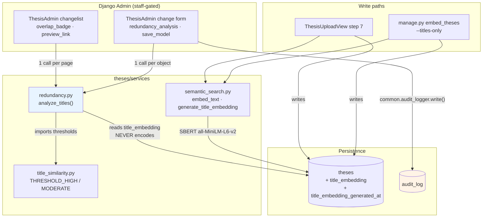
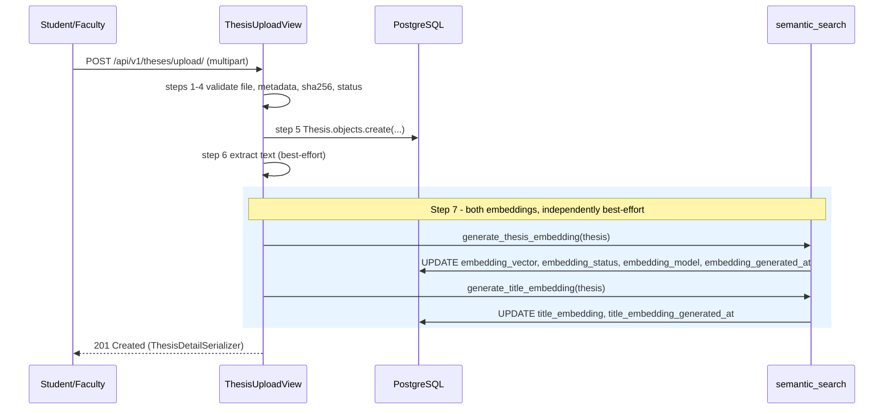
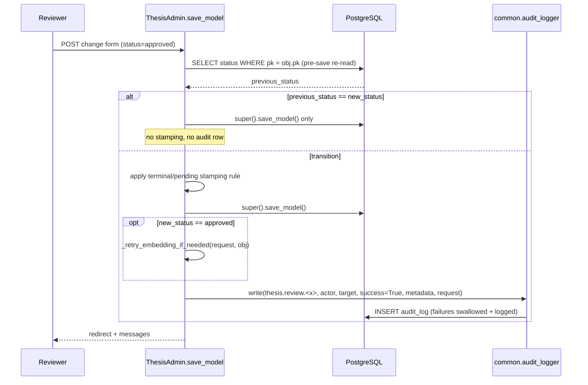
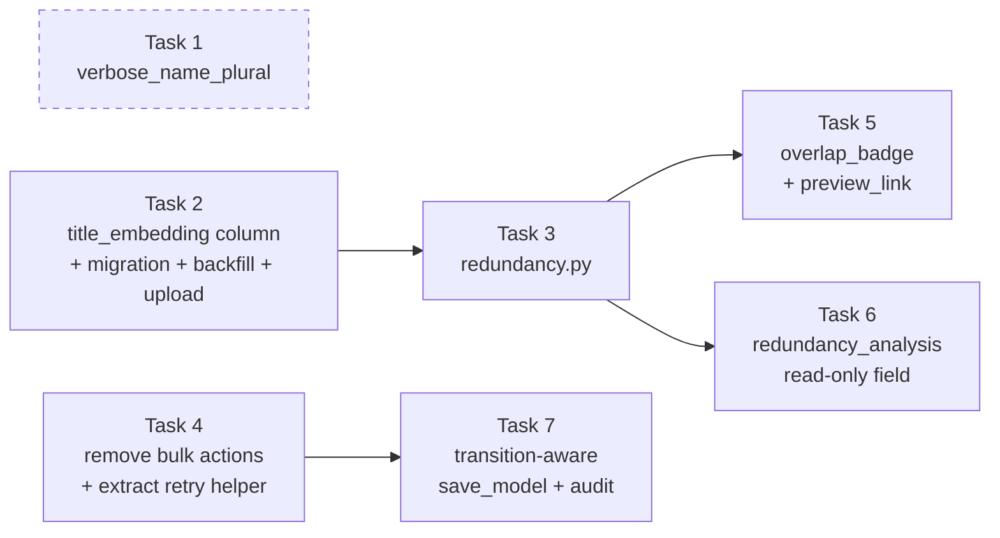

# Design Document: Thesis Review Redundancy & Audit

## Overview

Faculty thesis moderation currently happens in the Django admin changelist, where three bulk
actions (`approve_theses`, `reject_theses`, `mark_pending_review`) let a reviewer approve or reject
an arbitrary selection in one click. That contradicts the requirement that every manuscript receive
an individual evaluation, and it leaves two further gaps: the reviewer sees no redundancy signal at
the moment of decision, and no durable record of who decided what is written anywhere.

This feature closes all three gaps in the same change. Bulk mutation is removed entirely
(`actions = None`, which also strips Django's built-in `delete_selected`), so a status change can
only happen through the per-object change form. The change form and changelist gain a redundancy
signal computed from precomputed title embeddings — a new `theses/services/redundancy.py` module
that batches the whole rendered page into a single matrix multiplication against the approved
corpus. And `save_model` becomes transition-aware: it re-reads the pre-save status from the
database, applies a single stamping rule to `reviewed_by` / `reviewed_at`, and writes one
`AuditLog` row per real status transition through the existing `common.audit_logger.write()`.

The redundancy signal is deliberately read-only and never encodes text at render time. It reads a
new nullable `Thesis.title_embedding` column that the upload path and the `embed_theses` management
command populate. A thesis without that column simply renders a grey "not computed" badge —
the admin request path never loads the 90 MB SBERT model.

### Grounding in existing code

| Existing surface | How this design uses it |
|---|---|
| `theses/models.py` → `Thesis`, `ThesisStatus`, `EmbeddingStatus` | Adds `verbose_name_plural` and two nullable embedding columns |
| `theses/services/title_similarity.py` → `THRESHOLD_HIGH = 0.85`, `THRESHOLD_MODERATE = 0.60` | Imported by `redundancy.py` — single source of truth for cut-offs |
| `theses/services/semantic_search.py` → `embed_text`, `generate_thesis_embedding`, `EMBEDDING_DIM = 384` | New `generate_title_embedding` sits beside them; L2-normalised vectors mean cosine == dot product |
| `theses/views.py` → `ThesisUploadView.post` step 7 | Title embedding is generated alongside the composite embedding, same best-effort contract |
| `theses/admin.py` → `ThesisAdmin.status_badge` palette | `overlap_badge` reuses `#28A745` / `#FFA500` / `#DC3545`, grey `#6C757D` for not-computed |
| `common/audit_logger.py` → `write(event_type, *, actor, target, success, metadata, request)` | Swallows its own exceptions, so a log failure cannot break a review |
| `audit/models.py` → `AuditLog` | Append-only; `metadata` is a JSONField, `event_type` is `CharField(max_length=64)` |
| `frontend/src/App.jsx` → `<Route path="/theses/:id/preview" …>` | The `preview_link` target already exists and is auth-gated by `ProtectedRoute` |

### Decisions that extend the plan (flagged explicitly)

1. **`generate_title_embedding` lives in `semantic_search.py`.** Both `views.py` and `embed_theses.py`
   need it, and that module is already the single source of truth for embed-and-persist. This adds
   one file to Task 2's touch list.
2. **`FRONTEND_URL` does not exist in settings today.** `thesys/settings/base.py` reads a
   `FRONTEND_ORIGIN` env var into `CORS_ALLOWED_ORIGINS` (default `http://localhost:5173`).
   `preview_link` resolves its base through a `_frontend_base_url()` helper that prefers
   `settings.FRONTEND_URL`, falls back to `CORS_ALLOWED_ORIGINS[0]`, then to the localhost default.
3. **The page-batching hook is a `ChangeList` subclass, not `get_queryset` alone.** `get_queryset`
   runs *before* pagination, so computing there would analyse every filtered row rather than the
   rendered page. The design keeps the plan's intent — one `analyze_titles` call per rendered page,
   badge reads a stashed map — by overriding `get_changelist` to return a subclass whose
   `get_results` fires the single call over `result_list`. See §6.1 for the fallback wiring.
4. **`RedundancyResult` carries `corpus_size`.** Without it, an empty approved corpus renders a green
   "Clean" badge that a reviewer could read as "checked and safe". The advisory note states the
   comparison corpus size so the badge is never read out of context.

---

## Architecture



Dependency direction is strictly downward. `redundancy.py` depends on `title_similarity.py` for
thresholds and on the `Thesis` model for reads; nothing depends on `redundancy.py` except the admin.
`redundancy.py` has no import edge to `semantic_search.py` — that absence is the structural
guarantee that the render path cannot trigger a model load.

### 2.1 Review page render path

```mermaid
sequenceDiagram
    participant R as Reviewer (browser)
    participant A as ThesisAdmin
    participant CLS as _RedundancyChangeList
    participant RED as redundancy.analyze_titles
    participant C as _APPROVED_CACHE
    participant DB as PostgreSQL

    R->>A: GET /admin/theses/thesis/
    A->>CLS: get_results(request)
    CLS->>DB: paginated SELECT (select_related uploader, reviewer)
    DB-->>CLS: result_list (<= page_size rows)
    CLS->>RED: analyze_titles(result_list)
    RED->>DB: aggregate Count(id), Max(updated_at) over approved+embedded
    DB-->>RED: (count, latest)
    alt cache key matches
        RED->>C: reuse matrix M, ids, titles
    else key changed or cold
        RED->>DB: SELECT id, title, title_embedding (order_by created_at, id)
        DB-->>RED: rows
        RED->>C: store (key, M, ids, titles)
    end
    RED->>RED: S = P @ M.T ; mask self ; argmax ; map to label
    RED-->>CLS: dict[UUID, RedundancyResult]
    CLS->>A: stash map on request
    loop per rendered row
        A->>A: overlap_badge(obj) reads stashed map
    end
    A-->>R: HTML (all titles escaped via format_html placeholders)
```

No SBERT model load, no `embed_text` call, and at most two extra queries for the whole page.

### 2.2 Upload embedding path



The two calls are wrapped in **separate** `try/except` blocks. A composite-embedding failure must
not skip the title embedding, and neither failure blocks the 201 — matching the existing
best-effort contract of steps 6 and 7.

### 2.3 Review decision path



---

## Data Models

### 3.1 `Thesis.Meta` — Task 1

```python
class Meta:
    db_table = 'theses'
    verbose_name = 'Thesis'
    verbose_name_plural = 'Theses'
    ordering = ['-created_at']
    # indexes / constraints unchanged
```

Django's default pluralisation produces "Thesiss" in every admin breadcrumb, header, and
`message_user` string. `verbose_name` / `verbose_name_plural` are pure metadata: they do not appear
in the database schema, so `python manage.py makemigrations --check --dry-run` must report **no
changes** after this edit. That command is the acceptance check for Task 1.

### 3.2 New columns — Task 2

```python
# ── Title-only embedding (redundancy analysis at review time) ────────
# Separate from embedding_vector: the composite (title + abstract +
# extracted_text + keywords) inflates title-vs-title similarity for any
# thesis whose abstract merely mentions related concepts. Same rationale
# as title_similarity.rank_titles comparing titles only.
title_embedding = models.JSONField(null=True, blank=True)
title_embedding_generated_at = models.DateTimeField(null=True, blank=True)
```

| Field | Type | Null | Contents |
|---|---|---|---|
| `title_embedding` | `JSONField` | yes | 384-float L2-normalised SBERT vector of `title` alone, or `NULL` |
| `title_embedding_generated_at` | `DateTimeField` | yes | UTC timestamp of the last successful title encode, or `NULL` |

**Usable embedding** — the single term every reader uses, matching the Glossary in
`requirements.md`:

> A `title_embedding` is a **Usable embedding** iff it is a list of exactly **384 finite numbers**
> whose **L2 norm is at least `1e-6`**.

```pascal
FUNCTION is_usable_embedding(v)
  RETURN v IS A LIST
     AND length(v) = EMBEDDING_DIM                          // 384
     AND (∀ x ∈ v : x IS A NUMBER AND isfinite(x))          // no str, no NaN, no ±inf
     AND l2_norm(v) >= 1e-6                                 // not the zero vector
END FUNCTION
```

Anything else — `NULL`, an empty list, a non-list, a wrong-length list, a list holding a
non-numeric / NaN / infinite element, or an all-zero vector — is **not** a Usable embedding.
§5.2, §5.3, and §5.4 are written in terms of this one predicate rather than restating the
conditions inline; the only place the conditions are distinguished from each other is the
*reason code* a probe receives (§5.4).

**Validation / invariants**

- `title_embedding` is either `NULL` or a Usable embedding, in the intended steady state. Readers
  must not assume it: every reader tests the predicate.
- Vectors are L2-normalised at write time by `embed_text`, so cosine similarity reduces to a dot
  product. `redundancy.py` relies on this and does **not** re-normalise. The `>= 1e-6` norm floor is
  what makes that reliance safe — a zero or near-zero vector would make the dot product meaningless
  rather than merely small.
- A vector that is not a Usable embedding is treated as **absent** by readers, never as an error.
- `title_embedding_generated_at IS NOT NULL` implies `title_embedding IS NOT NULL`. The reverse is
  not guaranteed for rows backfilled by future tooling, so readers must not use the timestamp as a
  presence test — presence is tested by reading `title_embedding` itself.
- No `CheckConstraint` is added: JSON shape validation in Postgres would need a costly expression
  index and readers already degrade gracefully.

**Empty / whitespace-only titles — the one case that stores a non-Usable vector on purpose.**
`semantic_search.embed_text` short-circuits before the model call:

```python
if not text or not text.strip():
    return [0.0] * EMBEDDING_DIM      # verified in semantic_search.py
```

So a thesis whose `title` is empty or whitespace-only gets a stored `title_embedding` of exactly 384
zeros, a populated `title_embedding_generated_at`, and no exception. That vector has L2 norm 0, so it
is **not** a Usable embedding, and the consequence chain is:

1. `title_embedding IS NOT NULL`, so the row is inside the Approved-corpus *query* (§5.2) — the
   `IS NOT NULL` predicate cannot see the zeros.
2. The usability filter drops it from the matrix `M`, so it is excluded from every result's
   `corpus_size` and can never be returned as `matched_thesis_id`.
3. Used as a probe, it yields `computed = False` with `reason = 'missing_title_embedding'` — the
   *treated-as-absent* branch, not `dimension_mismatch`, because the length is a correct 384.

That is a data-quality outcome, not a bug: an untitled thesis has no title to compare. `embed_theses
--titles-only --regenerate` after the title is filled in replaces the zero vector.

### 3.3 Migration strategy

`theses/migrations/0003_thesis_title_embedding_and_more.py`, depending on `('theses', '0002_…')`:

```python
operations = [
    migrations.AddField(
        model_name='thesis',
        name='title_embedding',
        field=models.JSONField(blank=True, null=True),
    ),
    migrations.AddField(
        model_name='thesis',
        name='title_embedding_generated_at',
        field=models.DateTimeField(blank=True, null=True),
    ),
]
```

- **Schema only. No `RunPython`, no data migration.** Both columns are nullable with no default, so
  Postgres adds them as catalog-only changes — no table rewrite, no lock held for the row count.
- Existing rows land on `NULL`, which every reader already handles as "not computed".
- Backfill is an explicit, operator-run step: `python manage.py embed_theses --titles-only`. Keeping
  it out of the migration means a slow SBERT pass can never stall a deploy or a test-database setup,
  and matches how `0002` introduced `embedding_vector` without embedding anything.
- Reverse migration is a plain `RemoveField` pair generated by Django; it drops derived data only.

### 3.4 `embed_theses --titles-only` — Task 2

```python
parser.add_argument(
    '--titles-only',
    action='store_true',
    help='Generate only Thesis.title_embedding (skip the composite embedding).',
)
```

| `--titles-only` | `--regenerate` | Selected queryset | Columns written | Columns left untouched |
|---|---|---|---|---|
| no | no | `embedding_vector__isnull=True` | composite set (current behaviour) | `title_embedding`, `title_embedding_generated_at` |
| no | yes | all | composite set (current behaviour) | `title_embedding`, `title_embedding_generated_at` |
| yes | no | `title_embedding__isnull=True` | `title_embedding`, `title_embedding_generated_at`, `updated_at` | `embedding_vector`, `embedding_status`, `embedding_model`, `embedding_generated_at` |
| yes | yes | all | `title_embedding`, `title_embedding_generated_at`, `updated_at` | `embedding_vector`, `embedding_status`, `embedding_model`, `embedding_generated_at` |

The two flags are orthogonal; `--titles-only` swaps both the selection predicate and the generator
function, leaving the existing per-row `try/except`, progress lines, and final tally untouched. A
per-row encode failure counts as failed, the loop continues, no exception escapes, and
`ok + failed == count(selected)`.

**The write is a focused update, not a full row save.** `generate_title_embedding` persists with
`save(update_fields=['title_embedding', 'title_embedding_generated_at', 'updated_at'])` — exactly the
three columns and no more, mirroring how `generate_thesis_embedding` already writes only its own
five. `updated_at` is in the list because it is `auto_now` and because §5.2's cache key depends on it
advancing; the composite columns are *not* in the list, which is what makes the two backfill modes
non-destructive to each other.

**Plain `--titles-only` does not detect a stale embedding.** Its selection predicate is
`title_embedding__isnull=True`, which is a *presence* test, not a *freshness* test. A thesis whose
title was edited after its embedding was written still has a non-NULL `title_embedding`, so the
plain backfill skips it and the stored vector keeps describing the superseded title. Nothing in this
design compares `title_embedding_generated_at` against a title-change timestamp — the model does not
record when `title` last changed, so the comparison is not available. Refreshing a stale embedding
requires either `--titles-only --regenerate` (which selects all rows and overwrites) or a call to
`generate_title_embedding` for that thesis, such as the one `_retry_embedding_if_needed` makes on
approval (§6.7). Operators editing titles in bulk should follow with
`embed_theses --titles-only --regenerate`.

---

## Components and Interfaces

### 4.1 `theses/services/redundancy.py` (new) — Task 3

```python
"""Review-time redundancy analysis over precomputed title embeddings."""

# Labels
LABEL_CLEAN: str          # 'Clean'
LABEL_MODERATE: str       # 'Moderate'
LABEL_HIGH: str           # 'High Overlap'
LABEL_UNKNOWN: str        # 'Not computed'

# Reason codes (empty string when computed successfully)
REASON_MISSING_EMBEDDING: str    # 'missing_title_embedding'
REASON_DIMENSION_MISMATCH: str   # 'dimension_mismatch'
REASON_MATH_UNAVAILABLE: str     # 'vector_math_unavailable'

@dataclass(frozen=True)
class RedundancyResult:
    thesis_id: UUID
    computed: bool                    # False => could not measure
    score: float                      # max cosine in [-1, 1]; 0.0 when not computed
    label: str                        # one of the LABEL_* constants
    matched_thesis_id: UUID | None    # never equals thesis_id
    matched_title: str                # '' when there is no match
    corpus_size: int                  # approved+embedded rows compared against
    reason: str = ''                  # REASON_* when computed is False

def label_for(score: float) -> str: ...
def advisory_for(label: str) -> str: ...
def analyze_titles(theses: Iterable[Thesis]) -> dict[UUID, RedundancyResult]: ...
def invalidate_cache() -> None: ...   # test seam + explicit ops hook
```

**Responsibilities**

- Batch every probe thesis into exactly one `P @ M.T` matrix multiplication.
- Exclude each probe from matching itself, by id.
- Cache the approved-corpus matrix across requests, keyed on corpus identity.
- Map a score to a label using the thresholds owned by `title_similarity.py`.
- Degrade to `computed=False` rather than raising, and never call `embed_text`.

**Non-responsibilities** — it does not write to the database, does not encode text, does not import
`semantic_search`, and does not know anything about HTML or Django admin.

### 4.2 `ThesisAdmin` — Tasks 4–7

```python
class _RedundancyChangeList(ChangeList):
    def get_results(self, request) -> None:
        """Populate result_list, then stash the page's redundancy in one call."""

class ThesisAdmin(admin.ModelAdmin):
    actions = None                                    # Task 4

    # Task 5 — changelist
    def get_changelist(self, request, **kwargs) -> type[ChangeList]: ...
    def get_queryset(self, request) -> QuerySet[Thesis]: ...
    def overlap_badge(self, obj: Thesis) -> SafeString: ...
    def preview_link(self, obj: Thesis) -> SafeString: ...

    # Task 6 — change form
    def redundancy_analysis(self, obj: Thesis) -> SafeString: ...

    # Task 7 — review decision
    def save_model(self, request, obj: Thesis, form, change: bool) -> None: ...
    def _retry_embedding_if_needed(self, request, thesis: Thesis) -> None: ...

    # helpers
    @staticmethod
    def _frontend_base_url() -> str: ...
    @staticmethod
    def _redundancy_for(obj: Thesis, request=None) -> RedundancyResult: ...
```

**Display registration**

```python
list_display = (
    'title_short', 'program', 'year', 'status_badge', 'overlap_badge',
    'uploaded_by_name', 'embedding_status', 'preview_link', 'created_at',
)

readonly_fields = (
    'id', 'sha256', 'uploaded_file', 'file_type', 'extracted_text_preview',
    'embedding_vector_info', 'uploaded_by', 'created_at', 'updated_at',
    'redundancy_analysis',            # Task 6
    'reviewed_by', 'reviewed_at',     # Task 7 — now set only by save_model
)

# 'Review Status' fieldset — exactly this five-element ordered tuple, closed to other fields
'fields': ('status', 'rejection_reason', 'redundancy_analysis', 'reviewed_by', 'reviewed_at')
```

The Review Status fieldset tuple is **pinned**, not illustrative: it is exactly
(`status`, `rejection_reason`, `redundancy_analysis`, `reviewed_by`, `reviewed_at`), in that order,
with no sixth field. `status` and `rejection_reason` stay editable; `redundancy_analysis`,
`reviewed_by`, and `reviewed_at` are in `readonly_fields`, so the fieldset renders three
non-editable panels below two editable inputs — the reviewer sees the signal and the provenance in
the same box where the decision is made. Adding a field here (or reordering it) changes what a
reviewer reads at decision time, so it is a design change rather than a cosmetic one.

Column placement in `list_display` (`overlap_badge` next to `status_badge`, `preview_link` before
`created_at`) is, by contrast, a presentation choice and not a constraint.

### 4.3 Removed surface — Task 4

| Removed | Replacement |
|---|---|
| `approve_theses` action | per-object change form + `save_model` |
| `reject_theses` action | per-object change form + `save_model` |
| `mark_pending_review` action | per-object change form + `save_model` |
| `delete_selected` (Django built-in) | per-object delete confirmation page |

`actions = None` is the mechanism. Setting `actions = []` would leave `delete_selected` in place,
because Django re-adds the site-wide default to a non-`None` list — `None` disables the action
machinery for this ModelAdmin outright.

**The one behaviour that must survive the deletion:** `approve_theses` contained an
embedding-retry block. Without it, a thesis whose SBERT encode failed at upload time can be approved
and then sit in the repository permanently invisible to semantic search and title similarity. Task 4
moves that logic verbatim into `_retry_embedding_if_needed`, which Task 7 calls on any transition
into `approved`. Deleting the action without extracting the helper is a silent regression, not a
cleanup.

---

## Low-Level Design: `redundancy.py`

### 5.1 Threshold-to-label mapping

Thresholds are **imported**, never redeclared:

```python
from .title_similarity import THRESHOLD_HIGH, THRESHOLD_MODERATE   # 0.85, 0.60
```

```python
def label_for(score: float) -> str:
    if score >= THRESHOLD_HIGH:       # >= 0.85
        return LABEL_HIGH             # 'High Overlap'   red    #DC3545
    if score >= THRESHOLD_MODERATE:   # >= 0.60
        return LABEL_MODERATE         # 'Moderate'       orange #FFA500
    return LABEL_CLEAN                # 'Clean'          green  #28A745
```

| Score | Label | Badge colour |
|---|---|---|
| `score < 0.60` | Clean | `#28A745` |
| `0.60 <= score < 0.85` | Moderate | `#FFA500` |
| `score >= 0.85` | High Overlap | `#DC3545` |
| not computed | Not computed | `#6C757D` |

**Exact boundary behaviour** (both bounds are inclusive-lower, mirroring
`title_similarity.classify`, so the two surfaces can never disagree on the same score):

| Input | Result |
|---|---|
| `0.5999999` | Clean |
| `0.60` | **Moderate** |
| `0.8499999` | Moderate |
| `0.85` | **High Overlap** |
| `1.0` | High Overlap |
| `-1.0` | Clean |

### 5.2 Approved-matrix cache

```python
_CacheKey = tuple[int, datetime | None]     # (count, max(updated_at))

_cache_key: _CacheKey | None = None
_cache_ids: list[UUID] = []
_cache_titles: list[str] = []
_cache_matrix = None                        # np.ndarray (N, 384) float32
_cache_lock = threading.Lock()
```

Key semantics — the cached corpus is identified by `(count, max(updated_at))` over
`status='approved' AND title_embedding IS NOT NULL`:

- `updated_at` is `auto_now`, so **any** save to an approved thesis (including a title edit that
  changes its embedding) advances `max(updated_at)` and invalidates the key.
- Any insert into, or delete from, the approved+embedded set changes `count`.
- Deriving the key costs one aggregate query: `.aggregate(n=Count('id'), latest=Max('updated_at'))`.
- The key is derived from the `IS NOT NULL` predicate, but the **matrix admits only rows carrying a
  Usable embedding** (§3.2). The two sets differ by exactly the malformed rows, so `count` in the key
  may exceed `N = len(M)`. That is deliberate: the key's job is change detection, not accounting.
  `corpus_size` is computed from `N`, never from the key.
- The cache is **process-local**, like the SBERT model cache in `semantic_search._get_model`. Each
  gunicorn worker builds its own copy on first use. There is no cross-process coherence problem
  because the key is re-derived from the database on every call — a stale process can only ever be
  one aggregate query away from noticing.
- Matrix rows are ordered `order_by('created_at', 'id')`. This deterministic ordering is what makes
  `argmax` tie-breaking stable, which in turn is what makes batch and single-thesis analysis produce
  identical results (Property 1).

**Concurrency: one lock, one snapshot per caller.** `_cache_lock` guards **all four** pieces of
cached state — `_cache_key`, `_cache_matrix`, `_cache_ids`, `_cache_titles` — as a single unit, never
one field at a time:

```pascal
FUNCTION load_approved_matrix()
  OUTPUT: (ids, titles, M) — one coherent snapshot
  SEQUENCE
    key ← aggregate_key()                       // outside the lock: a read-only DB round trip
    WITH _cache_lock DO
      IF _cache_key = key AND _cache_matrix IS NOT NULL THEN
        RETURN (_cache_ids, _cache_titles, _cache_matrix)     // all three from one load
      END IF
      rows   ← SELECT id, title, title_embedding
                 WHERE status = 'approved' AND title_embedding IS NOT NULL
                 ORDER BY created_at, id
      admitted ← [r ∈ rows : is_usable_embedding(r.title_embedding)]
      ids ← ids_of(admitted) ; titles ← titles_of(admitted) ; M ← stack(admitted)
      _cache_key, _cache_ids, _cache_titles, _cache_matrix ← key, ids, titles, M
      RETURN (ids, titles, M)
    END WITH
  END SEQUENCE
END FUNCTION
```

Two guarantees follow, and both matter:

1. **Snapshot consistency.** A caller receives `ids`, `titles`, and `M` that came from *one* load.
   The tuple is returned by value under the lock and never re-read afterwards, so a concurrent
   rebuild cannot leave a caller holding row `j` of a new `M` alongside `ids[j]` of an old load.
   Without the single lock, a torn update could make `matched_thesis_id` name one thesis while
   `matched_title` shows another's title — a wrong answer rendered with full confidence.
2. **No exception under contention.** Every path through the lock either returns a complete tuple or
   raises before any cached field is written. A failed corpus load leaves the previous snapshot
   intact (§5.4), so a concurrent caller that holds the lock next still sees a coherent cache.

The aggregate query runs *outside* the lock. It touches no shared state, and holding the lock across
a DB round trip would serialise every concurrent changelist render on it.

**Accepted behaviour — the cache-key collision.** If a delete and an insert leave both `count` and
`max(updated_at)` unchanged between two calls, the derived key is unchanged and the cached matrix is
reused: results are measured against the **pre-mutation** corpus until the key changes or
`invalidate_cache()` is called. This is an accepted behaviour of the design, not a defect to be
worked around. `auto_now` makes it effectively unreachable — a newly written row's timestamp is
strictly later than the maximum it replaces, at the timestamp resolution Postgres stores — and the
signal is advisory, so the worst case is one render measured against a corpus that is one mutation
stale. `invalidate_cache()` is the explicit escape hatch for tests and for ops after a bulk
out-of-band mutation. Widening the key (a content hash, a version counter) would cost either a full
corpus scan per call or a new column, and buys nothing the advisory signal needs.

### 5.3 Batch algorithm

```pascal
ALGORITHM analyze_titles(theses)
INPUT:  theses — iterable of Thesis rows (the rendered page, or a single object)
OUTPUT: results — map from thesis id to RedundancyResult

BEGIN
  probes ← materialise(theses)
  IF probes IS EMPTY THEN
    RETURN empty map
  END IF

  // ── Phase 1: partition probes by embedding usability ──────────────
  // Precedence is fixed and total: shape first, then length, then elements.
  // Exactly one branch fires per probe, so a reason is assigned exactly once.
  results ← empty map
  usable_rows ← empty list          // list of (id, vector)
  FOR each t IN probes DO
    v ← t.title_embedding

    IF v IS NULL OR v IS NOT A LIST OR v IS EMPTY THEN
      // absent, wrong type, or []  →  nothing to measure
      results[t.id] ← not_computed(t.id, REASON_MISSING_EMBEDDING)

    ELSE IF length(v) ≠ EMBEDDING_DIM THEN
      // LENGTH IS CHECKED BEFORE ANY ELEMENT VALUE. A 12-float vector that
      // also holds a NaN is dimension_mismatch, never missing_title_embedding.
      results[t.id] ← not_computed(t.id, REASON_DIMENSION_MISMATCH)

    ELSE IF NOT is_usable_embedding(v) THEN
      // length is already exactly 384, so only element-level checks remain:
      // a non-numeric element, a NaN, an infinity, or L2 norm < 1e-6.
      // Such a vector is TREATED AS ABSENT — same reason code as NULL.
      results[t.id] ← not_computed(t.id, REASON_MISSING_EMBEDDING)

    ELSE
      usable_rows.append((t.id, v))
    END IF
  END FOR

  IF usable_rows IS EMPTY THEN
    RETURN results                  // every probe already accounted for
  END IF

  // ── Phase 2: load the approved corpus (cached, one snapshot) ───────
  TRY
    // ids, titles, and M come from ONE load under _cache_lock (§5.2), so
    // ids[j] and titles[j] always describe row j of M.
    ids, titles, M ← load_approved_matrix()      // (N,) (N,) (N, 384)
  CATCH any exception
    // Only probes in usable_rows are touched. Probes already finalised in
    // Phase 1 keep their own reason — a corpus or matmul failure NEVER
    // overwrites missing_title_embedding or dimension_mismatch.
    FOR each (id, _) IN usable_rows DO
      results[id] ← not_computed(id, REASON_MATH_UNAVAILABLE)
    END FOR
    RETURN results                  // cached key/matrix/ids/titles left untouched
  END TRY

  IF N = 0 THEN
    FOR each (id, _) IN usable_rows DO
      results[id] ← RedundancyResult(id, computed=TRUE, score=0.0,
                                     label=LABEL_CLEAN, matched=NULL,
                                     matched_title='', corpus_size=0)
    END FOR
    RETURN results
  END IF

  // ── Phase 3: one matrix multiplication ─────────────────────────────
  TRY
    P ← stack(vectors of usable_rows)            // (K, 384) float32
    S ← P · Mᵗ                                   // (K, N)  — the only matmul
    ASSERT shape(S) = (K, N)
  CATCH any exception                            // NumPy absent, BLAS error, …
    // Same containment rule as Phase 2: usable probes only.
    FOR each (id, _) IN usable_rows DO
      results[id] ← not_computed(id, REASON_MATH_UNAVAILABLE)
    END FOR
    RETURN results
  END TRY

  // ── Phase 4: self-exclusion by id ──────────────────────────────────
  col_of ← map from approved id to column index
  FOR i FROM 0 TO K-1 DO
    ASSERT ∀ j < i : results[usable_rows[j].id] is finalised
    j ← col_of[usable_rows[i].id]                // NULL when probe not approved
    IF j ≠ NULL THEN
      S[i, j] ← NEGATIVE_INFINITY
    END IF
  END FOR

  // ── Phase 5: reduce, clamp, label ──────────────────────────────────
  FOR i FROM 0 TO K-1 DO
    id ← usable_rows[i].id
    effective_N ← N − (1 IF col_of[id] ≠ NULL ELSE 0)

    IF effective_N = 0 THEN                      // corpus is only this thesis
      results[id] ← RedundancyResult(id, TRUE, 0.0, LABEL_CLEAN,
                                     NULL, '', corpus_size=0)
      CONTINUE
    END IF

    j* ← argmax(S[i, :])                         // lowest index wins ties
    raw ← S[i, j*]
    score ← clamp(raw, −1.0, 1.0)
    results[id] ← RedundancyResult(
        thesis_id     = id,
        computed      = TRUE,
        score         = score,
        label         = label_for(score),
        matched       = ids[j*],
        matched_title = titles[j*],
        corpus_size   = effective_N)
  END FOR

  ASSERT keys(results) = { t.id : t ∈ probes }
  RETURN results
END
```

**Preconditions**

- `theses` is iterable and every element exposes `id` and `title_embedding`. Elements may be
  unsaved instances.
- Every non-null `title_embedding` in the database was produced by `embed_text`, hence L2-normalised.
- No database write is in flight that this function depends on.

**Postconditions**

- `keys(result) == {t.id for t in theses}` — exactly one result per **distinct** probe id, no key
  ever missing. A repeated id yields one entry, so `len(result) == len(set(probe ids))`.
- `computed=True` implies `-1.0 <= score <= 1.0` and `label == label_for(score)`.
- `computed=False` implies `score == 0.0`, `label == LABEL_UNKNOWN`, `matched_thesis_id is None`,
  `matched_title == ''`, and `corpus_size == 0`.
- **`reason == '' if and only if `computed is True`.** The two fields are not independent: a
  computed result never carries a reason, and a non-computed result always carries exactly one.
- `reason ∈ {'', REASON_MISSING_EMBEDDING, REASON_DIMENSION_MISMATCH, REASON_MATH_UNAVAILABLE}` —
  the `REASON_*` set is **closed at three codes**. No fourth code, no free-form string, no code
  derived from an exception message.
- A reason assigned in Phase 1 is final. Phases 2 and 3 write only to ids in `usable_rows`, so a
  corpus-load or matmul failure cannot relabel a `missing_title_embedding` or `dimension_mismatch`
  probe as `vector_math_unavailable`.
- `matched_thesis_id != thesis_id` for every result.
- `matched_thesis_id is not None` implies `matched_title` is that thesis's stored title, taken from
  the same snapshot load as `matched_thesis_id`.
- No `matched_thesis_id` names a corpus row that was excluded from `M` for lack of a Usable embedding.
- No row is written. `embed_text` is not called. No exception escapes.

**Loop invariants**

- Phase 1: every probe visited so far is either in `results` or in `usable_rows`, never both; and
  every `results` entry written so far carries a non-empty `reason` drawn from the closed set.
- Phase 4: `S` rows below `i` have had their self-column masked; rows at or above `i` are untouched.
- Phase 5: `results` contains a finalised entry for every probe index below `i`.

### 5.4 Graceful degradation ladder

The ladder is ordered: the first matching row wins, and the order is the precedence encoded in §5.3
Phase 1.

| # | Condition | Outcome | `reason` | Badge |
|---|---|---|---|---|
| 1 | Probe `title_embedding` is `NULL`, an empty list, or **not a list** at all | `computed=False` | `missing_title_embedding` | grey |
| 2 | Probe `title_embedding` is a non-empty list whose **length ≠ 384** | `computed=False` | `dimension_mismatch` | grey |
| 3 | Probe `title_embedding` is a list of **exactly 384** values that is **not a Usable embedding** — a non-numeric element, a NaN, an infinity, or L2 norm `< 1e-6` (including the all-zero vector) | treated as **absent**: `computed=False` | `missing_title_embedding` | grey |
| 4 | NumPy import fails, or the matmul raises | `computed=False` for probes that reached Phase 3 | `vector_math_unavailable` | grey |
| 5 | Loading the Approved corpus raises a database error | `computed=False` for probes that reached Phase 2; cached key/matrix/ids/titles left untouched | `vector_math_unavailable` | grey |
| 6 | Approved corpus admits **0** rows to `M` | `computed=True`, `score=0.0`, `LABEL_CLEAN`, `matched=None`, `matched_title=''`, `corpus_size=0` | `''` | green + "no other approved thesis" note |
| 7 | The only admitted row is the probe itself | same as row 6 | `''` | green + "no other approved thesis" note |
| 8 | A stored **corpus** row is not a Usable embedding | that row is dropped from `M`, excluded from every `corpus_size`, and never returned as `matched_thesis_id` | n/a | unaffected |
| 9 | `analyze_titles` raises inside the ChangeList hook | warning logged, stash set to `{}` | n/a | grey for every row |

**Rows 1–3 are the precedence that matters.** Length is checked **before** any element-level check,
so a 12-float vector holding a NaN is `dimension_mismatch` (row 2) and never
`missing_title_embedding`. Conversely, a correctly-sized 384-value vector that is unusable for
*content* reasons is folded into `missing_title_embedding` (row 3) rather than getting a code of its
own: from a reviewer's standpoint "the stored vector cannot be used" and "there is no stored vector"
are the same situation with the same fix, and the panel's remedy text — run
`embed_theses --titles-only --regenerate` — is identical.

**Rows 4–5 cannot overwrite rows 1–3.** A NumPy or corpus failure relabels only the probes that
carried a Usable embedding and therefore reached Phase 2. A probe already finalised in Phase 1 keeps
its own reason. Without that containment rule, one environment fault would erase the per-probe data
diagnosis for the whole page and every badge would say `vector_math_unavailable`, sending the
operator to fix BLAS when the actual fix was a backfill.

**The `REASON_*` set is closed at three codes** — `missing_title_embedding`, `dimension_mismatch`,
`vector_math_unavailable` — and `reason == ''` **iff** `computed is True`. Nine ladder rows collapse
onto three codes on purpose: the code drives §6.4's fixed remedy map (§6.4, Requirement 11), so
adding a code without adding a map entry would render the default fallback text. Any new failure mode
must be classified into one of the three, never appended as a fourth.

`computed` answers "could we measure?", not "was there anything to measure against". Rows 6 and 7 are
real measurements of zero overlap, consistent with `title_similarity.classify_title` returning
`LOW_SIMILARITY / 0.0` for an empty queryset. `corpus_size` on the advisory line is what keeps a
green badge from being misread as a clean bill of health over an empty repository.

**Every ladder row keeps the review functional.** Under any of rows 1–9, a staff `GET` to the
changelist, the add form, or a change form returns HTTP 200, and a change-form `POST` carrying a new
status still persists that status and returns a non-5xx response. The signal degrades; the decision
does not.

**The invariant that matters most:** `analyze_titles` never calls `embed_text`, never imports
`semantic_search`, and never loads a model. A missing embedding is a data-quality problem to be
fixed by `embed_theses --titles-only`, not something to paper over with a synchronous 90 MB model
load inside an admin page render.

---

## Low-Level Design: Admin

### 6.1 Page batching — Task 5

```python
def get_changelist(self, request, **kwargs):
    return _RedundancyChangeList

def get_queryset(self, request):
    qs = super().get_queryset(request).select_related('uploaded_by', 'reviewed_by')
    request._thesis_redundancy = {}          # reset the per-request stash
    return qs
```

```pascal
CLASS _RedundancyChangeList EXTENDS ChangeList

  PROCEDURE get_results(request)
    SEQUENCE
      super.get_results(request)             // populates self.result_list (the page)
      TRY
        request._thesis_redundancy ← analyze_titles(self.result_list)
      CATCH any exception
        log warning
        request._thesis_redundancy ← empty map
      END TRY
    END SEQUENCE
  END PROCEDURE

END CLASS
```

`select_related('uploaded_by', 'reviewed_by')` removes the N+1 that `uploaded_by_name` causes today
and that a reviewer column would add.

> **Fallback wiring.** If the `ChangeList` subclass is undesirable, `analyze_titles` can be called
> from `get_queryset` over the filtered queryset instead. It is still one matmul; the only cost is
> that `P` grows with the filter result size rather than the page size, and that `get_queryset` also
> runs for the change, delete, and autocomplete views where the map is never read. The stash key and
> `overlap_badge` are unchanged either way.

### 6.2 `overlap_badge`

```pascal
PROCEDURE overlap_badge(obj)
  INPUT:  obj — Thesis
  OUTPUT: SafeString (badge markup)

  SEQUENCE
    result ← stashed_map.get(obj.id)          // set by _RedundancyChangeList

    IF result IS NULL THEN                    // rendered outside a changelist
      result ← analyze_titles([obj]).get(obj.id)
    END IF

    IF result IS NULL OR result.computed IS FALSE THEN
      RETURN format_html(BADGE_TEMPLATE, '#6C757D', 'Not computed')
    END IF

    color ← CASE result.label OF
              LABEL_HIGH     → '#DC3545'
              LABEL_MODERATE → '#FFA500'
              LABEL_CLEAN    → '#28A745'
            END CASE

    text ← result.label + ' ' + format_percent(result.score)
    RETURN format_html(BADGE_TEMPLATE, color, text)     // placeholders only
  END SEQUENCE
END PROCEDURE
```

`short_description = 'Overlap'`. The badge template is the same inline-style span shape as
`status_badge`, so the two columns line up visually, and the label colour is the span's
`background-color` with white text. `admin_order_field` is deliberately **not** set — the score is
computed, not stored, so it is not sortable and offering a dead sort header would mislead. The badge
text is label + percentage only: **`corpus_size` never appears on the badge**, because a changelist
column has no room for the context that makes the number meaningful. Corpus context is rendered
exclusively by the §6.4 panel.

**`format_percent` — the single pinned definition.** Both surfaces call this one function, so an
identical score always produces a byte-identical percentage substring on the changelist and on the
change form:

```pascal
FUNCTION format_percent(score)
  INPUT:  score — float in [-1.0, 1.0]
  OUTPUT: string

  SEQUENCE
    pct ← score × 100
    // Rounded HALF AWAY FROM ZERO to exactly one decimal place — not
    // banker's rounding. Python's round() and format() round half to even,
    // so this uses Decimal(str(pct)).quantize(Decimal('0.1'), ROUND_HALF_UP).
    // ROUND_HALF_UP in Decimal means "away from zero", which is what we want
    // symmetrically for negatives.
    rounded ← quantize(pct, one_decimal, HALF_AWAY_FROM_ZERO)
    RETURN decimal_string(rounded) + '%'      // leading '-' for negatives
  END SEQUENCE
END FUNCTION
```

| Score | Rendered percentage |
|---|---|
| `0.8543` | `85.4%` |
| `0.8545` | `85.5%` (half away from zero, not `85.4%`) |
| `-0.0321` | `-3.2%` |
| `-0.0325` | `-3.3%` (away from zero on the negative side too) |
| `0.0` | `0.0%` |
| `1.0` | `100.0%` |
| `-1.0` | `-100.0%` |

Exactly one decimal place, always — `0.6` renders `60.0%`, never `60%`.

**The label comes from the unrounded score, the percentage from the rounded one.** `label_for` is
applied to `result.score` as stored, never to the rounded display value. The two can therefore
disagree at a threshold boundary, and that is the correct behaviour:

| Score | Label (unrounded) | Percentage (rounded) | Rendered badge text |
|---|---|---|---|
| `0.5999` | `Clean` | `60.0%` | `Clean 60.0%` |
| `0.60` | `Moderate` | `60.0%` | `Moderate 60.0%` |
| `0.8499` | `Moderate` | `85.0%` | `Moderate 85.0%` |
| `0.85` | `High Overlap` | `85.0%` | `High Overlap 85.0%` |

A reviewer seeing `Clean 60.0%` is looking at a score below the moderate cut-off that rounds up to
it for display. Deriving the label from the rounded value instead would move the effective threshold
to `0.5995`, silently disagreeing with `title_similarity.classify` on the same score — the exact
divergence §5.1 exists to prevent.

### 6.3 `preview_link`

```pascal
PROCEDURE _frontend_base_url()
  OUTPUT: base URL string, no trailing slash
  SEQUENCE
    base ← getattr(settings, 'FRONTEND_URL', NULL)
    IF base IS NULL THEN
      origins ← getattr(settings, 'CORS_ALLOWED_ORIGINS', empty list)
      base ← origins[0] IF origins IS NOT EMPTY ELSE 'http://localhost:5173'
    END IF
    RETURN rstrip(base, '/')
  END SEQUENCE
END PROCEDURE

PROCEDURE preview_link(obj)
  SEQUENCE
    url ← _frontend_base_url() + '/theses/' + str(obj.id) + '/preview'
    RETURN format_html(
      '<a href="{}" target="_blank" rel="noopener noreferrer">Preview</a>', url)
  END SEQUENCE
END PROCEDURE
```

`short_description = 'Preview'`. The path matches the existing React route
`/theses/:id/preview` (`PdfPreviewPage`), which sits behind `ProtectedRoute`. The href contains only
a settings-derived origin and a UUID — no user-supplied text — and is still passed through a
`format_html` placeholder.

### 6.4 `redundancy_analysis` — Task 6

```pascal
PROCEDURE redundancy_analysis(obj)
  INPUT:  obj — Thesis (may be unsaved on the add form)
  OUTPUT: SafeString — read-only panel in the Review Status fieldset

  SEQUENCE
    IF obj IS NULL OR obj.pk IS NULL THEN
      RETURN format_html('<em>{}</em>',
                         'Redundancy analysis is available after the thesis is saved.')
    END IF

    result ← analyze_titles([obj]).get(obj.id)

    IF result IS NULL OR result.computed IS FALSE THEN
      code        ← result.reason IF result IS NOT NULL ELSE ''
      reason_text ← REASON_TEXT.get(code, REASON_TEXT_DEFAULT)   // fixed map, never a Thesis value
      RETURN format_html(
        '<span style="color:{}">{}</span><br><small>{} Run: {}</small>',
        '#6C757D', 'Not computed', reason_text,
        'manage.py embed_theses --titles-only')
    END IF

    IF result.corpus_size = 0 THEN                   // implies matched_thesis_id IS NULL
      RETURN format_html(
        '<strong style="color:{}">{}</strong> &nbsp; {}<br><small>{} {}</small>',
        color_for(result.label), result.label, format_percent(result.score),
        'There is no other approved thesis to compare against.',
        advisory_for(result.label))
    END IF

    match_url ← reverse('admin:theses_thesis_change', args=[result.matched_thesis_id])

    IF result.corpus_size = 1 THEN
      RETURN format_html(
        '<strong style="color:{}">{}</strong> &nbsp; {}<br>'
        'Closest approved match: <a href="{}">{}</a><br>'
        '<small>Compared against 1 approved thesis. {}</small>',
        color_for(result.label), result.label, format_percent(result.score),
        match_url, result.matched_title,               // user-supplied → placeholder
        advisory_for(result.label))
    END IF

    // corpus_size >= 2
    RETURN format_html(
      '<strong style="color:{}">{}</strong> &nbsp; {}<br>'
      'Closest approved match: <a href="{}">{}</a><br>'
      '<small>Compared against {} approved theses. {}</small>',
      color_for(result.label), result.label, format_percent(result.score),
      match_url, result.matched_title,                 // user-supplied → placeholder
      result.corpus_size,
      advisory_for(result.label))
  END SEQUENCE
END PROCEDURE
```

**Corpus-size wording — three branches, not one pluralised string.** The earlier
`'thes{}'.format(pluralise(n))` shape cannot express the zero case, because "compared against 0
approved theses" reads as a failure when it is a correct measurement over an empty corpus. The rule
is:

| `corpus_size` | Rendered sentence | Numeral present? |
|---|---|---|
| `>= 2` | `Compared against {n} approved theses.` — decimal integer + plural noun `theses` | yes |
| `== 1` | `Compared against 1 approved thesis.` — the literal `1` + singular noun `thesis` | yes |
| `== 0` | `There is no other approved thesis to compare against.` | **no** |

The `0` branch is the only one that omits a numeral, and it is also the only branch with no
matched-thesis link — `corpus_size == 0` and `matched_thesis_id is None` are equivalent (ladder rows
6 and 7), so a single test drives both. The `1` branch hard-codes the numeral in the format string
rather than passing it as a placeholder: there is exactly one value it can be.

**Reason text — a fixed admin-owned map with a default.** The machine reason code selects a sentence
from a module-level constant in `admin.py`. Nothing from the `Thesis` row reaches it:

```python
REASON_TEXT = {
    'missing_title_embedding': 'No usable title embedding is stored for this thesis.',
    'dimension_mismatch':      'The stored title embedding has the wrong number of dimensions.',
    'vector_math_unavailable': 'The similarity engine is unavailable on this server right now.',
}
REASON_TEXT_DEFAULT = 'Similarity could not be measured for this record.'
```

Constraints this map must satisfy:

- **Fixed and admin-owned.** The mapping lives in `theses/admin.py`, not in `redundancy.py` and not in
  the database. `redundancy.py` owns machine codes; the admin owns human wording.
- **Default fallback.** A code with no entry — including `''` and any code a future change adds
  without updating the map — renders `REASON_TEXT_DEFAULT`. A `KeyError` on an admin render path is
  not an acceptable outcome for an advisory signal.
- **Bounded at 200 characters** per string, so the panel cannot be pushed out of shape.
- **Distinct per code.** The three sentences are pairwise different, so the reason code is
  recoverable from the rendered page — that is what makes the panel useful for diagnosing which
  remedy applies.
- **No `Thesis` field value.** No title, no id, no program. Every string is a literal. This is what
  keeps the whole not-computed branch free of user-supplied text.

**Advisory text — `advisory_for(label)`, four bounded distinct strings.** `advisory_for` is a total
function over the four labels, returns a non-empty string for each, each at most **300 characters**,
and the four are **pairwise distinct**. It is derived solely from `result.label` and, like the reason
map, contains no value read from any `Thesis` field.

`short_description = 'Redundancy analysis'`. Advisory text is phrased as guidance, never as a
verdict — the reviewer decides:

| Label | Advisory |
|---|---|
| High Overlap | Very close to an existing approved thesis. Compare scope, methodology, and target users before approving. |
| Moderate | Shares substantial wording with an existing thesis. May still be acceptable if scope or implementation differ. |
| Clean | No substantial title overlap with the approved corpus. |
| Not computed | Similarity could not be measured for this record. |

All four advisories are at most 300 characters and pairwise distinct, as `advisory_for` requires.

The match link uses `reverse('admin:theses_thesis_change', …)` so it survives a change to
`ADMIN_URL` or the mount point. It is rendered for every staff user regardless of that user's
permissions on the matched thesis; following it hits Django admin's own permission check, and the
panel exposes no field of the matched thesis other than its `title` and its id.

**The panel and the badge share one percentage formatter.** `redundancy_analysis` calls the same
`format_percent` defined in §6.2 — not a second implementation, not a template filter. That is the
mechanism behind the requirement that both surfaces yield an identical percentage substring for the
same score: `0.8543` is `85.4%` in the badge and `85.4%` in the panel, and a reviewer moving from the
changelist to the change form never sees the number shift. Two formatters that agree today would
drift the first time one of them changed its rounding mode.

### 6.5 `save_model` — Task 7

```pascal
PROCEDURE save_model(request, obj, form, change)
  INPUT:  request, obj (Thesis), form, change (boolean)
  OUTPUT: none — persists obj and, on transition, one audit row

  SEQUENCE
    // ── 1. Authoritative pre-save status, straight from the DB ──────
    previous_status ← NULL
    IF change AND obj.pk IS NOT NULL THEN
      previous_status ← Thesis.objects
                          .filter(pk=obj.pk)
                          .values_list('status', flat=TRUE)
                          .first()
    END IF

    new_status ← obj.status
    is_transition ← (previous_status ≠ new_status)

    // ── 2. Stamp or clear the review provenance ─────────────────────
    IF is_transition THEN
      IF new_status IN (APPROVED, REJECTED) THEN        // terminal
        obj.reviewed_by ← request.user
        obj.reviewed_at ← now()
      ELSE IF new_status = PENDING_REVIEW THEN          // reopened
        obj.reviewed_by ← NULL
        obj.reviewed_at ← NULL
      END IF
    END IF
    // no transition → both fields left exactly as stored

    // ── 3. Persist — ONE call, carrying status + provenance together ─
    super.save_model(request, obj, form, change)
    // Everything below runs only after this call has returned without raising.

    IF is_transition IS FALSE THEN
      RETURN                        // nothing decided → nothing to audit
    END IF

    // ── 4. Keep approved theses reachable by semantic search ────────
    //      AFTER super().save_model() returns, BEFORE the audit write.
    IF new_status = APPROVED THEN
      _retry_embedding_if_needed(request, obj)
    END IF

    // ── 5. Audit — after the write AND after the repair helper ──────
    audit_write(
      event_type = EVENT_FOR[new_status],
      actor      = request.user,
      target     = obj.uploaded_by,
      success    = TRUE,
      metadata   = { 'thesis_id':       str(obj.id),
                     'title':           obj.title[:200],
                     'previous_status': previous_status,   // NULL on create
                     'new_status':      new_status,
                     'program':         obj.program,
                     'year':            obj.year,
                     'created':         (change IS FALSE),
                     'rejection_reason': obj.rejection_reason[:500]
                                          IF new_status = REJECTED ELSE OMITTED },
      request    = request)
  END SEQUENCE
END PROCEDURE
```

**Preconditions** — `request.user` is an authenticated staff user (Django admin guarantees this);
`obj.status` is a valid `ThesisStatus` (enforced by the form and by `theses_status_check`).

**Postconditions** — `obj` is persisted; on a transition to a terminal status `reviewed_by ==
request.user` and `reviewed_at` is set; on a transition to `pending_review` both are `NULL`; on no
transition both are byte-identical to their stored values and no audit row exists; at most one audit
row is written per save.

**Why the pre-save status is re-read instead of using `form.changed_data`:** `changed_data` compares
against the form's `initial`, which is populated when the page was rendered. If another reviewer
changed the status in the meantime, `initial` is stale — `changed_data` can report a change that
did not happen, or miss one that did. The database is the only authority on what the status was an
instant before the write.

**The ordering is normative, not incidental.** Four points, in exactly this sequence:

| # | Step | Position |
|---|---|---|
| 1 | Read the pre-save status from the database | before anything else |
| 2 | Assign `reviewed_by` / `reviewed_at` | **before** `super().save_model(...)` |
| 3 | `super().save_model(...)` | one call, persisting status **and** provenance together |
| 4 | `_retry_embedding_if_needed` | **after** step 3 returns |
| 5 | `Review_Audit_Writer` | **after** step 4 has run |

Each adjacency carries a reason:

- **Provenance before the save.** Assigning `reviewed_by` / `reviewed_at` before step 3 means the one
  `UPDATE` carries the status and the provenance together. Assigning after would need a second write,
  which opens a window where a row is `approved` with a NULL reviewer — the exact state the
  accountability requirement exists to rule out.
- **Repair after the save.** `_retry_embedding_if_needed` calls generators that persist with their own
  focused `update_fields` saves. Running them before step 3 would let a full-row save overwrite what
  they wrote, and would embed a thesis whose approval then failed to persist.
- **Audit after the repair.** Placing the audit write last means the row's `created_at` is at or after
  the persisted thesis's `updated_at`, so the audit trail never claims a decision that the `theses`
  table does not show. If step 3 raises, no audit row is written at all.
- **Audit needs no `try/except`.** `common.audit_logger.write` already swallows and logs its own
  failures, which is exactly the property that lets a log outage degrade to "decision recorded in
  `theses`, missing from `audit_log`" rather than "reviewer sees a 500". Symmetrically, a repair
  failure in step 4 does not skip step 5 — the decision is still audited.

§2.3's sequence diagram encodes the same order: stamping rule → `super().save_model()` →
`opt new_status == approved: _retry_embedding_if_needed` → `write(...)` → `INSERT audit_log`. The
diagram and this pseudocode are the same contract stated twice; if one is edited, the other must be.

**Note on a behaviour change:** the old `save_model` stamped `reviewed_by` only `if not
obj.reviewed_by`, preserving whoever was there first. The new rule overwrites on every transition.
That is the point — the fields are now read-only in the form, so they can only ever mean "who made
the most recent decision", and the full history lives in `audit_log`.

### 6.6 Status transition matrix

`EVENT_FOR` maps the *destination* status to an event type, following the dotted convention already
used by `identity_verification/services/audit.py` (`access_request.verification.approved`, etc.):

| previous → new | `reviewed_by` | `reviewed_at` | `event_type` | Audit row |
|---|---|---|---|---|
| `pending_review` → `approved` | ← `request.user` | ← `now()` | `thesis.review.approved` | yes |
| `pending_review` → `rejected` | ← `request.user` | ← `now()` | `thesis.review.rejected` | yes |
| `approved` → `rejected` | ← `request.user` | ← `now()` | `thesis.review.rejected` | yes |
| `rejected` → `approved` | ← `request.user` | ← `now()` | `thesis.review.approved` | yes |
| `approved` → `pending_review` | ← `NULL` | ← `NULL` | `thesis.review.reopened` | yes |
| `rejected` → `pending_review` | ← `NULL` | ← `NULL` | `thesis.review.reopened` | yes |
| `approved` → `approved` | untouched | untouched | — | **no** |
| `rejected` → `rejected` | untouched | untouched | — | **no** |
| `pending_review` → `pending_review` | untouched | untouched | — | **no** |
| *(create)* `NULL` → `approved` | ← `request.user` | ← `now()` | `thesis.review.approved` | yes, `created: true` |
| *(create)* `NULL` → `rejected` | ← `request.user` | ← `now()` | `thesis.review.rejected` | yes, `created: true` |
| *(create)* `NULL` → `pending_review` | ← `NULL` | ← `NULL` | `thesis.review.reopened` | yes, `created: true` |

Two rules generate the whole table: **terminal statuses stamp the reviewer and the timestamp;
returning to `pending_review` clears both.** A create is a transition from `NULL`, so it follows the
same rules — an admin who creates an already-approved record is recorded as its reviewer.

All three event types fit inside `AuditLog.event_type`'s 64 characters
(`thesis.review.approved` is 22). Those three values are the only ones this feature emits.

**Editing only `rejection_reason` on an already-rejected thesis is a No-op save.** It is the common
case that makes the classification rule feel counter-intuitive, so it is worth stating on its own.
The reviewer opens a `rejected` thesis, rewrites the reason to be clearer, and saves without touching
the status dropdown:

| What happens | What does not happen |
|---|---|
| The submitted `rejection_reason` **is persisted** — it is an ordinary editable field and `super().save_model(...)` writes it | No provenance write: `reviewed_by` and `reviewed_at` stay byte-identical to their stored values |
| | No audit row: the `rejected → rejected` row of the table above applies |

That is the intended behaviour, not a gap. `save_model` classifies a save by comparing the pre-save
status with the submitted status and by nothing else, so "which other fields changed" cannot promote a
No-op save into a Transition. The provenance fields answer "who made the most recent *decision*", and
rewording a rejection is not a new decision — the original rejection, with its original reviewer and
timestamp, still stands. The `audit_log` row written when the thesis was first rejected remains the
durable record of that decision; a reason edit adds no second row to it.

The same rule applies to a title edit, a keyword edit, or an `approved → approved` re-save: the field
change persists, the provenance and the audit trail do not move.

### 6.7 `_retry_embedding_if_needed` — extracted in Task 4, called in Task 7

```pascal
PROCEDURE _retry_embedding_if_needed(request, thesis)
  INPUT:  request, thesis — a Thesis that has just become APPROVED
  OUTPUT: none — best-effort embedding repair plus a user-visible message

  SEQUENCE
    IF thesis.embedding_status = READY THEN
      RETURN
    END IF

    TRY
      generate_thesis_embedding(thesis)          // persists on success
      generate_title_embedding(thesis)
      message_user(request, 'Embedding regenerated for this thesis.')
    CATCH any exception
      log warning
      message_user(request,
        'This thesis could not be embedded — semantic search and redundancy '
        'analysis will not cover it. Check server logs.',
        level = WARNING)
    END TRY
  END SEQUENCE
END PROCEDURE
```

Same lifecycle guarantee the deleted `approve_theses` provided, now per object: an approved thesis is
either semantically searchable or the reviewer is told, on the page, that it is not. Failure never
rolls back the approval — the review decision and the embedding are independent concerns.

---

## Example Usage

```python
# ── Service: batch (changelist) ──────────────────────────────────────
from theses.services.redundancy import analyze_titles, LABEL_HIGH

page = list(Thesis.objects.filter(status=ThesisStatus.PENDING_REVIEW)[:20])
results = analyze_titles(page)                       # one matmul, <= 2 queries

for thesis in page:
    r = results[thesis.id]                           # never a KeyError
    if r.computed and r.label == LABEL_HIGH:
        print(f'{thesis.title!r} ~ {r.matched_title!r} @ {r.score:.3f}')

# ── Service: single object (change form) ─────────────────────────────
r = analyze_titles([thesis])[thesis.id]
assert r.matched_thesis_id != thesis.id              # self-exclusion
assert r.computed is False or -1.0 <= r.score <= 1.0

# ── Non-Usable embeddings degrade, never raise ───────────────────────
draft = Thesis(title='Untitled', title_embedding=None)
r = analyze_titles([draft])[draft.id]
assert (r.computed, r.label, r.reason) == (False, 'Not computed', 'missing_title_embedding')

# a whitespace-only title stores 384 zeros -> norm 0 -> treated as absent
blank = Thesis(title='   ', title_embedding=[0.0] * 384)
assert analyze_titles([blank])[blank.id].reason == 'missing_title_embedding'

# length is checked BEFORE element values: a short vector holding a NaN is
# dimension_mismatch, not missing_title_embedding
short = Thesis(title='x', title_embedding=[float('nan')] * 12)
assert analyze_titles([short])[short.id].reason == 'dimension_mismatch'

# ── Boundary behaviour ───────────────────────────────────────────────
from theses.services.redundancy import label_for
assert label_for(0.5999) == 'Clean'
assert label_for(0.60)   == 'Moderate'          # inclusive
assert label_for(0.8499) == 'Moderate'
assert label_for(0.85)   == 'High Overlap'       # inclusive

# ── Percentage format: label from the unrounded score ────────────────
# format_percent rounds half away from zero to one decimal place;
# label_for reads the raw score, so the two can straddle a boundary.
assert render_badge_text(0.5999) == 'Clean 60.0%'
assert render_badge_text(0.8499) == 'Moderate 85.0%'
assert render_badge_text(-0.0321) == 'Clean -3.2%'

# ── Backfill ─────────────────────────────────────────────────────────
# python manage.py embed_theses --titles-only              # missing only
# python manage.py embed_theses --titles-only --regenerate # all rows
```

---

## Correctness Properties

Suitable for property-based testing with **Hypothesis**, matching the existing
`backend/tests/property/` convention (`pytestmark = pytest.mark.property`). Vectors are generated as
random unit vectors in R^384 so the L2-normalisation precondition holds by construction; no SBERT
model is loaded in any of these tests.

Every `Validates` reference below was re-checked against the refined `requirements.md`, criterion by
criterion, after that document's criteria counts changed to 9/9/16/27/14/6/15/10/11/15/8/6.

| # | Property | Statement | Validates |
|---|---|---|---|
| **P1** | Batch ≡ single | `∀ corpus, ∀ probes P: ∀ t ∈ P: analyze_titles(P)[t.id] == analyze_titles([t])[t.id]` — score, label, and `matched_thesis_id` all identical. Holds exactly because the approved matrix is ordered `('created_at', 'id')`, making `argmax` tie-breaking deterministic. Also: the multiplication operation is invoked **exactly once** per call for every `K` and every `N`, and the changelist passes the paginated `result_list` rather than the filtered queryset. | **Validates: Requirements 4.2, 4.16, 4.17, 4.23** |
| **P2** | Self-exclusion | `∀ t: analyze_titles(theses)[t.id].matched_thesis_id != t.id`, including when `t` is itself approved and embedded. A thesis is never its own redundancy match, even at cosine 1.0; when it is the only admitted corpus row the result is `Clean / 0.0 / corpus_size 0`. | **Validates: Requirements 4.12, 5.7** |
| **P3** | Label monotonicity | `∀ a, b ∈ [-1, 1]: a <= b ⟹ rank(label_for(a)) <= rank(label_for(b))` where `rank(Clean) < rank(Moderate) < rank(High Overlap)`. A higher score can never yield a less severe label. | **Validates: Requirements 4.7, 4.8, 4.9** |
| **P4** | Boundary exactness | `label_for(0.60) == Moderate ∧ label_for(0.85) == High Overlap ∧ ∀ ε > 0: label_for(0.60 - ε) == Clean ∧ label_for(0.85 - ε) == Moderate`. `label_for(s)` is severity-equivalent to `classify(s)` for every `s`, so `redundancy` and `title_similarity` never disagree. And the label is derived from the **unrounded** score while the percentage is rounded independently, so `0.5999 → 'Clean 60.0%'` and `0.8499 → 'Moderate 85.0%'`; `format_percent` is shared, so badge and panel emit an identical percentage substring for the same score. | **Validates: Requirements 4.6, 4.10, 4.11, 7.3, 7.14, 8.4** |
| **P5** | Score / reason domain | `∀ r: r.computed ⟹ -1.0 <= r.score <= 1.0 ∧ r.label == label_for(r.score) ∧ r.reason == ''`, and `¬r.computed ⟹ r.score == 0.0 ∧ r.label == LABEL_UNKNOWN ∧ r.matched_thesis_id is None ∧ r.matched_title == '' ∧ r.corpus_size == 0 ∧ r.reason ∈ {missing_title_embedding, dimension_mismatch, vector_math_unavailable}`. The `REASON_*` set is closed at three codes and `reason == ''` **iff** `computed is True`. | **Validates: Requirements 4.14, 5.5, 5.13, 6.5** |
| **P6** | Total coverage | `∀ theses: keys(analyze_titles(theses)) == {t.id for t in theses}` and `len(result) == len(set(probe ids))` even when the input repeats an id. An empty input yields an empty mapping and zero queries. Every probe gets exactly one result, so the stash always has an entry for a rendered row and `overlap_badge` can never raise `KeyError`. | **Validates: Requirements 4.13, 4.24, 4.25, 5.9** |
| **P7** | No live encoding | With `semantic_search.embed_text` monkeypatched to raise, `analyze_titles` still returns normally for every input. Scores come only from stored `title_embedding` values, and `redundancy.py` contains zero imports referencing `semantic_search`, so the admin render path cannot trigger a model load. | **Validates: Requirements 4.3, 4.4, 4.5** |
| **P8** | Total function | `∀ theses` (0–200 probes, including NULL, non-list, wrong-dimension, non-numeric, NaN, infinite, zero-norm vectors, unsaved instances, and duplicate ids): `analyze_titles` returns a dict, writes no row, and raises nothing. Reason precedence is respected — length before elements — and a NumPy or corpus-load failure never overwrites a reason already assigned in Phase 1. Under every one of those degradations the changelist, add-form, and change-form GETs return 200 and a status-changing POST still persists with a non-5xx response. | **Validates: Requirements 4.22, 5.1, 5.2, 5.3, 5.4, 5.10, 5.11, 5.12, 5.14** |
| **P9** | Cache coherence | `∀ mutation m to the approved+embedded corpus: analyze_titles(P)` after `m` reflects `m`. Adding, removing, re-approving, or re-embedding a thesis changes `(count, max(updated_at))`, so the cached matrix is rebuilt with exactly one corpus query; an unchanged key issues zero; `invalidate_cache()` forces a rebuild. | **Validates: Requirements 4.18, 4.19, 4.20, 4.21** |
| **P10** | Transition stamping | `∀ (prev, new) with prev != new: new ∈ {approved, rejected} ⟹ reviewed_by == actor ∧ reviewed_at != None`, and `new == pending_review ⟹ reviewed_by is None ∧ reviewed_at is None`. `prev` is always the value read from the database, never `form.initial`, so a stale form neither invents nor suppresses a transition, a create is a transition from NULL, an existing reviewer is overwritten, and in a two-reviewer sequence the second save reads the first's persisted status. Only `save_model` ever writes these two fields; a submitted value for either is discarded without a validation error. | **Validates: Requirements 8.3, 8.8, 9.1, 9.2, 9.3, 9.4, 9.5, 9.6, 9.9, 9.10** |
| **P11** | No-op invariance | `∀ save with prev == new: (reviewed_by, reviewed_at)` are byte-identical to their stored values **and** `AuditLog.objects.count()` is unchanged, regardless of which other editable fields the form changed. A submitted `rejection_reason` still persists — including the `rejected → rejected` reason-rewrite case. | **Validates: Requirements 8.9, 9.7, 9.11, 10.9** |
| **P12** | Audit ↔ transition bijection | `∀ sequence of saves: count(audit rows with event_type startswith 'thesis.review.') == count(saves where prev != new)`. One row per decision, never zero, never two; destination status selects one of exactly three event types; metadata carries exactly the seven required keys plus `rejection_reason` only on a rejection; each row in a two-reviewer sequence carries its own `previous_status`. | **Validates: Requirements 10.1, 10.2, 10.3, 10.4, 10.6, 10.7, 10.8, 10.10, 10.12, 10.14** |
| **P13** | Audit durability | With `AuditLog.objects.create` patched to raise, every save still succeeds and the status change still persists — guaranteed by `common.audit_logger.write`'s own `try/except`. Conversely, if `super().save_model(...)` raises, no `thesis.review.` row is written. No `AuditLog` row is ever updated or deleted. | **Validates: Requirements 10.11, 10.13, 10.15** |
| **P14** | Output escaping | `∀ title containing any of `<`, `>`, `"`, `'`, `&`: overlap_badge(obj)` emits zero characters originating from that title, and `redundancy_analysis(obj)` emits each of those five characters only in escaped form. `<script>alert(1)</script>` and `" onmouseover="alert(1)` render as visible text. `∀ title containing `{`, `}`, `{0}`, `{advisory}`: the panel renders those braces literally, raises nothing, and places every other value in the same position it occupies for a brace-free title — the property that requires the format string to be a module literal and every value to arrive as a placeholder argument. | **Validates: Requirements 11.1, 11.2, 11.3, 11.4, 11.5, 11.6** |
| **P15** | No bulk mutation | `ThesisAdmin(admin.site).get_actions(request) == {}` for every request and every user, including superusers. `delete_selected` is absent, the three named actions are absent as attributes, and `admin.py` contains no other status-writing path. | **Validates: Requirements 1.1, 1.2, 1.3, 1.4, 1.5** |

### Properties added while mapping requirements

Six acceptance criteria families in `requirements.md` are universally quantified and testable, but had
no counterpart in the fifteen properties above. They are added here rather than left uncovered. The
statements above were widened during the reconciliation pass to cover newly split criteria, but no
property was removed and no property's technical claim was weakened.

| # | Property | Statement | Validates |
|---|---|---|---|
| **P16** | Corpus accounting | `∀ corpus, ∀ probe t: r.corpus_size == count(c ∈ corpus : c.status == approved ∧ c.title_embedding is a Usable embedding ∧ c.id != t.id)`, and no `matched_thesis_id` ever names a row excluded from that set, while `matched_title` is always the stored title of the row `matched_thesis_id` names. A stored vector that is not a Usable embedding — including the 384-zero vector `embed_text` returns for an empty or whitespace-only title — lowers `corpus_size` by exactly one. Rendering is a total function of `corpus_size`: `>= 2` → integer + `theses`; `== 1` → `1` + `thesis`; `== 0` → the no-other-approved-thesis sentence with no numeral, so a green badge over an empty corpus is textually distinguishable from a green badge over a populated one; and the badge never carries `corpus_size` at all. | **Validates: Requirements 3.14, 4.1, 4.15, 5.6, 5.8, 6.1, 6.2, 6.3, 6.4, 6.6** |
| **P17** | Backfill selection | `∀ corpus, ∀ (titles_only, regenerate) ∈ {T,F}²: written_rows == selection_predicate(titles_only, regenerate)` per §3.4; a `--titles-only` write touches exactly `title_embedding`, `title_embedding_generated_at`, and `updated_at` and leaves the four composite columns unchanged (and vice versa); `∀ failing subset F: ok + failed == count(corpus) ∧ failed == count(F)` with no exception escaping the command. And `∀ thesis whose title changed after its embedding was written:` plain `--titles-only` does **not** select it, so the stale vector survives until `--regenerate` or a direct `generate_title_embedding` call. | **Validates: Requirements 3.10, 3.11, 3.12, 3.13, 3.15** |
| **P18** | Preview link construction | `∀ base URL b (with 0–3 trailing slashes), ∀ uuid u: href(preview_link) == rstrip(b, '/') + '/theses/' + str(u) + '/preview'`, where `b` resolves as `settings.FRONTEND_URL`, else `CORS_ALLOWED_ORIGINS[0]`, else `http://localhost:5173`. Every emitted anchor carries both `target="_blank"` and `rel="noopener noreferrer"`, and one anchor is emitted for every rendered row regardless of status, file presence, or session state, with no authorization check performed against the target route. | **Validates: Requirements 7.6, 7.7, 7.8, 7.9, 7.10, 7.11, 7.15** |
| **P19** | Approval durability and ordering | `∀ (prev, approved) with prev != approved: _retry_embedding_if_needed` is invoked exactly once, strictly after `super().save_model(...)` returns and strictly before `Review_Audit_Writer`, which itself runs only after the helper has returned; provenance is assigned before `super().save_model(...)`. `∀ exception e raised by either generator:` the persisted status is still `approved` with `reviewed_by`/`reviewed_at` stamped and the audit row still written. `∀ save that is not a transition into approved:` the helper is not invoked and no embedding column moves. | **Validates: Requirements 2.1, 2.6, 2.7, 2.9, 9.8, 10.5** |
| **P20** | Advisory and reason-text totality | `∀ label ∈ {Clean, Moderate, High Overlap, Not computed}: advisory_for(label)` returns a non-empty string of at most 300 characters, the four are pairwise distinct, and each is derived solely from the label. `∀ reason code c: reason_text(c)` returns a non-empty string of at most 200 characters drawn from a fixed admin-owned map, distinct for each of the three codes, falling back to a fixed default for any unmapped `c` (so no code can raise `KeyError`), and containing no value read from any `Thesis` field. | **Validates: Requirements 8.6, 8.7, 11.7, 11.8** |
| **P21** | Cache snapshot consistency | `∀ n concurrent threads calling analyze_titles in one process:` every caller receives `ids`, `titles`, and `M` originating from a **single** load — `∀ result r with r.matched_thesis_id != None: r.matched_title == title_of(r.matched_thesis_id)` in the same snapshot, never a torn pairing of a new matrix row with an old id list — no caller raises, and every read and write of `(_cache_key, _cache_matrix, _cache_ids, _cache_titles)` happens under one lock. Conversely, `∀ delete+insert pair leaving both count and max(updated_at) unchanged:` the cached matrix is reused and results reflect the pre-mutation corpus until the key changes or `invalidate_cache()` is called — the accepted collision behaviour, asserted rather than treated as a defect. | **Validates: Requirements 4.26, 4.27** |

---

## Error Handling

| Scenario | Condition | Response | Recovery |
|---|---|---|---|
| Missing title embedding | probe `title_embedding` is NULL, `[]`, or not a list | grey "Not computed" badge, `missing_title_embedding`; analysis panel names the backfill command | `manage.py embed_theses --titles-only` |
| Unusable 384-value vector | probe vector is exactly 384 long but holds a non-number, NaN, or infinity, or has L2 norm `< 1e-6` | treated as absent — grey badge, `missing_title_embedding` | `--titles-only --regenerate` |
| Wrong dimension | probe vector length ≠ 384 | grey badge, `dimension_mismatch`; checked **before** any element-level test | `--titles-only --regenerate` |
| NumPy unavailable / matmul failure | import error or BLAS error inside `analyze_titles` | warning logged, `vector_math_unavailable` for probes that reached the matmul; probes already diagnosed in Phase 1 keep their own reason; page renders | fix the environment; no data loss |
| Corpus load failure | DB error while building the matrix | same as above, cached key/matrix/ids/titles left untouched | retry on next render |
| Empty approved corpus | no admitted rows | green "Clean", `corpus_size=0`, "no other approved thesis" note with no numeral | none needed |
| Malformed approved vector | one stored row is not a Usable embedding | dropped from `M`, excluded from `corpus_size`, never returned as `matched_thesis_id` | `--titles-only --regenerate` |
| Redundancy raises inside the ChangeList | any unexpected exception | caught in `get_results`, stash set to `{}`, every badge grey | changelist still loads |
| Embedding retry fails on approve | `generate_thesis_embedding` raises | approval **stands**; warning-level `message_user` tells the reviewer semantic search will not cover it | `embed_theses`, or re-save |
| Audit write fails | DB error inside `audit_logger.write` | swallowed and logged to the `audit` logger; review completes | ops investigates the `audit` log |
| Concurrent review of the same thesis | two reviewers submit the form | last write wins on `theses`; **both** transitions appear in `audit_log` with their own `previous_status` | audit trail shows the sequence |
| Frontend URL unset | no `FRONTEND_URL`, no `CORS_ALLOWED_ORIGINS` | link falls back to `http://localhost:5173` | set `FRONTEND_ORIGIN` / `FRONTEND_URL` |

Nothing in the review path raises into a 500. The redundancy signal is advisory, so every failure
mode degrades the *signal* while leaving the *decision* fully functional.

---

## Testing Strategy

### Unit tests

`backend/theses/tests/test_redundancy.py` — no SBERT, hand-built unit vectors:

- empty input → `{}` and zero queries
- empty approved corpus → `computed=True`, `Clean`, `corpus_size=0`
- self-exclusion when the probe is itself approved, including at cosine 1.0
- exact `0.60` → `Moderate`; exact `0.85` → `High Overlap`; `0.5999` → `Clean`; `0.8499` → `Moderate`
- one case per ladder row (§5.4): NULL / `[]` / non-list / wrong-length / non-numeric element / NaN /
  infinity / all-zero → the correct one of the three reason codes, with the length check proven to
  run before element checks
- a corpus-load or matmul failure does **not** overwrite a Phase 1 reason on the same page
- degradation when NumPy is unavailable (patched import) → no raise
- a corpus row that is not a Usable embedding is absent from `corpus_size` and from `matched_thesis_id`
- batch vs single consistency on a fixed fixture corpus
- cache hit reuses the matrix (query count assertion) and a corpus mutation forces a rebuild
- `ids`, `titles`, and `M` come from one load: a mutation racing a render never pairs a new
  `matched_thesis_id` with an old `matched_title`
- the accepted key-collision case: a hand-pinned identical `(count, max(updated_at))` reuses the
  stale matrix, and `invalidate_cache()` clears it
- `analyze_titles` never calls `embed_text` (patched to raise)
- `format_percent`: `0.8545` → `85.5%`, `-0.0325` → `-3.3%`, `0.6` → `60.0%`

`backend/theses/tests/test_admin_review.py`:

- `ThesisAdmin.get_actions(request) == {}`; `'delete_selected' not in` the response's action choices
- `approve_theses` / `reject_theses` / `mark_pending_review` are gone from the class
- each row of the transition matrix in §6.6 → `reviewed_by`, `reviewed_at`, and audit row asserted
- a no-op save (title edit only) writes no audit row and leaves the review fields untouched
- a `rejected → rejected` save that changes only `rejection_reason`: the reason persists, no audit
  row, `reviewed_by` / `reviewed_at` unchanged
- pre-save re-read wins over a stale `form.initial`
- call ordering asserted, not just outcomes: provenance assigned before `super().save_model`, repair
  helper after it returns, audit write after the repair helper (patched call recorder)
- transition to approved on a `FAILED`-embedding thesis calls the retry helper; a raising retry still
  leaves the thesis approved **and** still writes the audit row
- the Review Status fieldset is exactly the five-element tuple in §4.2
- `overlap_badge` emits zero characters from a title containing `<`, `>`, `"`, `'`, `&`;
  `redundancy_analysis` escapes all five in a matched title and renders `{advisory}` literally without
  raising or shifting any other value
- `preview_link` contains `rel="noopener noreferrer"` and `target="_blank"`
- corpus-size wording: `>= 2` → `theses`, `1` → `1 approved thesis`, `0` → no numeral
- reason text comes from the fixed map; an unmapped code renders the default rather than raising
- changelist renders with one `analyze_titles` call for a 20-row page (patched-and-counted)
- `redundancy_analysis` on an unsaved object returns the "available after save" text and makes zero
  `analyze_titles` calls

`backend/theses/tests/test_title_embedding.py`:

- upload populates both `embedding_vector` and `title_embedding` (SBERT patched)
- a composite-embedding failure still leaves `title_embedding` populated, and vice versa
- `generate_title_embedding` writes exactly `title_embedding`, `title_embedding_generated_at`,
  `updated_at` and leaves the four composite columns byte-identical
- a whitespace-only title stores 384 zeros, sets the timestamp, raises nothing, and is then absent
  from the corpus matrix and `computed=False / missing_title_embedding` as a probe
- `embed_theses --titles-only` selects only `title_embedding__isnull=True`, and specifically does
  **not** select a thesis whose title was edited after its embedding was written
- `embed_theses --titles-only --regenerate` selects everything and refreshes the stale row
- `makemigrations --check --dry-run` is clean after Task 1 and after Task 2's migration is applied

### Property-based tests

`backend/tests/property/test_redundancy_pbt.py`, `pytestmark = pytest.mark.property`.

**Library:** Hypothesis (already a dependency — see `backend/.hypothesis/` and
`backend/tests/property/test_common_pbt.py`).

Strategies: `unit_vector()` builds a 384-float list from `st.floats(-1, 1, allow_nan=False,
allow_infinity=False)` and L2-normalises it (rejecting the zero vector) — a Usable embedding by
construction; `unusable_vector()` draws from the complement (NULL, `[]`, a non-list, a wrong-length
list, a 384-list holding a string / NaN / infinity, and the all-zero vector) so the ladder's reason
precedence can be asserted branch by branch; `corpus()` builds lists of `(uuid, title, vector)`
triples mixing both; `score()` is `st.floats(-1.0, 1.0, allow_nan=False)`; `hostile_title()` draws
strings containing `<`, `>`, `"`, `'`, `&`, `{`, `}`, `{0}`, and `{advisory}`.

P1–P9, P14, and P16 map onto these strategies directly. P3/P4 (label monotonicity, boundaries, and
the label-from-unrounded-score rule) need no database at all — they are pure-function properties over
`score()`, and worth running with a high example count; so are P20's totality bounds. P21 runs a
`ThreadPoolExecutor` over `analyze_titles` with a corpus mutated between submissions and asserts the
`matched_thesis_id` / `matched_title` pairing in every returned result, plus the accepted collision
case with a hand-pinned `updated_at`. Database-touching properties use
`@hyp_settings(suppress_health_check=[HealthCheck.function_scoped_fixture], deadline=None)`,
consistent with the existing property suite.

### Integration tests

Django test client against `/admin/theses/thesis/` and `/admin/theses/thesis/<id>/change/` as a
staff user: the changelist renders with the overlap column, the change form shows the analysis panel
with `reviewed_by` / `reviewed_at` disabled, submitting a status change persists it and lands exactly
one `audit_log` row, and the action dropdown is absent from the rendered HTML.

---

## Performance Considerations

| Path | Cost |
|---|---|
| Changelist render (cache hit) | 1 aggregate query + 1 matmul `(K×384)·(384×N)` |
| Changelist render (cache miss) | + 1 `SELECT id, title, title_embedding` over approved rows |
| Change form render | same, with `K = 1` |
| `save_model` | + 1 `SELECT status` + 1 `INSERT audit_log` |
| Upload | + 1 SBERT title encode (~5 ms warm) + 1 focused `UPDATE` |

- **The matmul is the whole point.** Encoding `K` titles per page against `N` approved theses one
  pair at a time — the shape of `title_similarity.rank_titles` — is `K×N` dot products in Python plus
  `K + N` model calls. One `P @ M.T` is a single BLAS call: at `K = 100`, `N = 10 000` that is
  ~384 MFLOP, tens of milliseconds, and zero model calls.
- **Memory:** `M` is `N × 384` float32 = 1.5 KB per approved thesis, so 10 000 theses ≈ 15 MB per
  worker process. At the current demo scale (~15 records) it is negligible.
- **The cache** turns the steady-state cost of a page render into one aggregate query. It is
  process-local, so a fresh worker pays one corpus `SELECT`.
- **`select_related('uploaded_by', 'reviewed_by')`** removes the existing N+1 in `uploaded_by_name`.
- **Accepted regression:** reviewing N theses now costs N form submissions instead of one bulk
  action. That is the requirement, not a side effect.
- The upload path pays one extra title encode. The model is already loaded by
  `generate_thesis_embedding` on the preceding line, so the marginal cost is a single short encode.

---

## Security Considerations

**Stored XSS through thesis titles.** `Thesis.title` is a 500-character free-text field supplied by
uploaders, and it is now rendered inside two `SafeString`-returning admin callables. Every
user-supplied value goes through a `format_html` **placeholder** — never an f-string, never
`%`-formatting, never `mark_safe`:

```python
# correct — the title is escaped by format_html
return format_html('<span style="color:{}">{}</span>', color, result.matched_title)

# WRONG — pre-formats the title into trusted markup
return format_html(f'<span style="color:{color}">{result.matched_title}</span>')
```

This applies to `overlap_badge` (label + percentage, both derived) and, critically, to
`redundancy_analysis`, which renders **another thesis's** title — a title the current reviewer never
typed. The existing `extracted_text_preview` already follows this pattern; the new callables must
not break it.

**Five characters, not three.** The escaping obligation covers `<`, `>`, `"`, `'`, and `&`. `<` and
`>` are the obvious element-injection vector, but the other three each open a distinct hole and
`format_html` handles all five:

| Char | Escaped as | What it breaks if left raw |
|---|---|---|
| `<` | `&lt;` | Opens a new element — `<script>`, `` |
| `>` | `&gt;` | Closes an attacker-opened tag, letting the rest of the title become markup |
| `"` | `&quot;` | Terminates a double-quoted attribute — `" onmouseover="alert(1)` escapes the value and lands a handler in the tag |
| `'` | `&#x27;` | Terminates a single-quoted attribute, the same break for any single-quoted markup |
| `&` | `&amp;` | Lets a title smuggle an entity that decodes to one of the four above, defeating a naive filter |

`&` is the one most often skipped, and skipping it is what turns escaping into a filter that can be
walked around. The two canonical test payloads are `<script>alert(1)</script>` (element injection)
and `" onmouseover="alert(1)` (attribute break); both must render as visible text with zero unescaped
occurrences of `<script`, `</script`, or an attribute-terminating `"`.

**Brace injection — the failure `format_html` does *not* protect you from.** `format_html` escapes its
*arguments*; it also runs `str.format` over its *format string*. A title containing `{`, `}`, `{0}`, or
`{advisory}` is harmless as an argument and dangerous as part of a format string:

```python
# correct — braces in the title are just characters in a value
return format_html(
    '<small>Compared against {} approved theses. {}</small>',   # module literal
    result.corpus_size,
    advisory_for(result.label),
)

# WRONG — a title of '{advisory}' or '{0}' now participates in substitution
return format_html(
    f'<small>Closest match: {result.matched_title}. {{}}</small>',
    advisory_for(result.label),
)
# → KeyError('advisory') / IndexError, a 500 on the change form; or, worse,
#   the title's placeholder consumes a positional argument and every value
#   after it shifts one position, so the panel renders the wrong data in
#   the wrong slots without raising at all.
```

This is precisely why the requirement pins two things together: **the format string must be a literal
in the module defining `ThesisAdmin`, and every rendered value must arrive only as a placeholder
argument.** One without the other is not enough — a literal format string that has a value
concatenated onto it is no longer a literal, and a placeholder argument passed to an interpolated
format string is still exposed. Adjacent-string concatenation of literals (as in the multi-line
`format_html` calls in §6.4) is fine: the result is still a compile-time constant with no runtime
value in it.

A title of `{advisory}` must therefore render as the literal seven-character text `{advisory}`, raise
nothing, and leave the label, percentage, link, corpus sentence, and advisory in exactly the positions
they occupy for a brace-free title.

**Reverse tabnabbing on the preview link.** `target="_blank"` without `rel="noopener"` hands the
opened page a live `window.opener` reference to the admin tab, which it can navigate. Every preview
link carries `rel="noopener noreferrer"` — `noopener` severs the reference, `noreferrer` also
withholds the admin URL from the `Referer` header. The href itself is assembled from a
settings-derived origin plus a UUID, so no user-controlled text reaches it.

**Removal of the bulk mutation surface.** `actions = None` eliminates every mass-mutation entry
point on the changelist in one move: the three custom status actions and Django's
`delete_selected`. A misclick can no longer approve 200 theses or delete them. Combined with
per-object `save_model` auditing, the blast radius of any single admin request drops to one thesis,
and every status change now has a named actor, a timestamp, an IP, and a user agent in `audit_log`.

**Accountability.** `reviewed_by` and `reviewed_at` move into `readonly_fields`, so they can no
longer be hand-set to another user through the form — only `save_model` writes them. The
append-only `audit_log` retains the full decision history even after a later reviewer overwrites
them.

**Information exposure.** `redundancy_analysis` shows an approved thesis's title and a link to its
admin page. Django admin is already staff-gated, and approved theses are visible to every
authenticated user through `/api/v1/theses/`, so this exposes nothing new. No new endpoint, no new
permission, and no unauthenticated surface is introduced by this feature.

**Not addressed here:** the `/admin/` path itself, admin session policy, and the existing
`ThesisDownloadView` authorization model are unchanged.

---

## Dependencies

No new packages. Everything used already ships with the project:

| Dependency | Already used by | Role here |
|---|---|---|
| Django 5.0.x admin (`ChangeList`, `format_html`, `reverse`) | `theses/admin.py` | UI surface |
| NumPy | `semantic_search.rank_theses`, `title_similarity.rank_titles` | the single matmul |
| `sentence-transformers` (`all-MiniLM-L6-v2`) | `semantic_search._get_model` | write path only — never the render path |
| `common.audit_logger` + `audit.AuditLog` | `auth_service`, `access_requests`, `password_reset`, `identity_verification` | review audit trail |
| PostgreSQL JSONB | `embedding_vector`, `authors`, `keywords` | `title_embedding` storage |
| Hypothesis + pytest-django | `backend/tests/property/` | property-based tests |

Internal module dependencies: `redundancy.py → title_similarity.py` (thresholds) and
`redundancy.py → theses.models` (reads). `admin.py → redundancy.py`, `common.audit_logger`,
`semantic_search` (retry helper only). No circular imports; `redundancy.py` deliberately has **no**
edge to `semantic_search.py`.

---

## Task Dependency Order



`2 → 3 → (5, 6)` and `4 → 7`.

- **Task 1** is independent and can land at any time.
- **Task 2 before Task 3** — `redundancy.py` reads `title_embedding`; without the column it has
  nothing to read and cannot be tested against real data.
- **Task 3 before Tasks 5 and 6** — both admin surfaces call `analyze_titles`.
- **Task 4 before Task 7** — Task 4 extracts the embedding-retry helper out of `approve_theses`;
  Task 7's `save_model` calls it. Reversing the order either loses the retry logic or leaves
  `save_model` calling a function that does not exist yet.
- Tasks 5, 6, and 7 all edit `admin.py`, so they serialise on that file even where the graph shows
  no edge. Landing order 5 → 6 → 7 keeps the diffs small.
