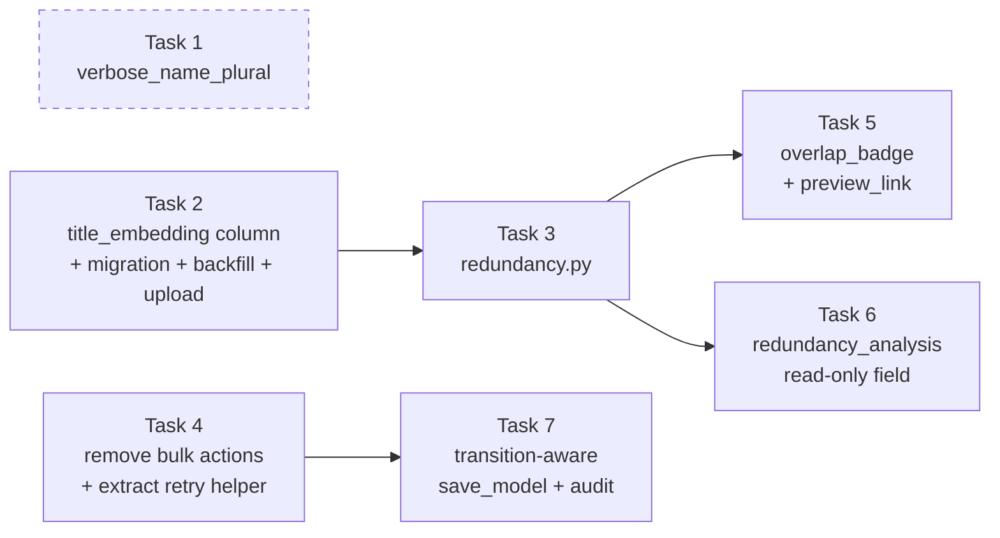

# Implementation Plan: Thesis Review Redundancy & Audit

## Overview

Faculty thesis moderation in the Django admin currently permits one-click bulk approval, which
contradicts the requirement that each manuscript receive individual evaluation. There is also no
redundancy signal at review time, and no audit trail for review decisions. This plan closes all three
gaps in the same change.

**Implementation Language:** Python (Django backend)

**Scope:** Seven tasks. Bulk mutation is removed entirely (`actions = None`, which also strips
Django's built-in `delete_selected`). A new `theses/services/redundancy.py` computes an advisory
overlap signal from precomputed title embeddings — one matrix multiplication per rendered page, never
a live encode. `save_model` becomes transition-aware: it re-reads the pre-save status from the
database, applies one stamping rule to `reviewed_by` / `reviewed_at`, and writes exactly one audit row
per real status transition.

**Dependency order:** `2 → 3 → (5, 6)` and `4 → 7`. Task 1 is independent. Tasks 5, 6, and 7 all edit
`backend/theses/admin.py`, so they serialise on that file even where the graph shows no edge; landing
order 5 → 6 → 7 keeps the diffs small.

**Derived from:** `design.md` and `requirements.md` in this directory.

## Task Dependency Graph



```json
{
  "waves": [
    {
      "wave": 1,
      "name": "Independent roots",
      "tasks": ["1", "2", "4"],
      "description": "Task 1 is pure model metadata with no schema effect. Task 2 adds the title embedding column and its write paths. Task 4 removes the bulk actions and extracts the embedding-retry helper. None of the three depend on each other."
    },
    {
      "wave": 2,
      "name": "Redundancy service",
      "tasks": ["3"],
      "depends_on": ["2"],
      "description": "analyze_titles reads Thesis.title_embedding, so the column from Task 2 must exist before this can be built or tested against real data."
    },
    {
      "wave": 3,
      "name": "Admin read surfaces",
      "tasks": ["5", "6"],
      "depends_on": ["3"],
      "description": "Both the changelist badge and the change-form panel call analyze_titles. They share admin.py, so land 5 before 6."
    },
    {
      "wave": 4,
      "name": "Review decision path",
      "tasks": ["7"],
      "depends_on": ["4", "6"],
      "description": "save_model calls the _retry_embedding_if_needed helper extracted in Task 4. Sequenced after 6 only because all three edit admin.py."
    }
  ]
}
```

## Tasks

- [ ] 1. Admin naming on `Thesis.Meta`
  - In `backend/theses/models.py`, add `verbose_name = 'Thesis'` and `verbose_name_plural = 'Theses'`
    to `Thesis.Meta`, replacing Django's default "Thesiss" pluralisation.
  - Leave `db_table = 'theses'`, `ordering = ['-created_at']`, all three declared indexes
    (`theses_status_created_idx`, `theses_program_idx`, `theses_year_idx`), and all three check
    constraints (`theses_status_check`, `theses_filetype_check`, `theses_year_range_check`) untouched.
  - Run `python manage.py makemigrations --check --dry-run` and confirm it reports no changes and
    exits 0. Both attributes are pure metadata and must produce no schema diff; a non-zero exit means
    something else in the model was edited by mistake.
  - _Requirements: 12.1, 12.2, 12.3, 12.5, 12.6_

- [ ] 2. Title embedding storage

- [ ] 2.1 Add the two nullable columns to the model
  - In `backend/theses/models.py`, add `title_embedding = models.JSONField(null=True, blank=True)`
    and `title_embedding_generated_at = models.DateTimeField(null=True, blank=True)` to `Thesis`.
  - Comment why this is separate from `embedding_vector`: the composite embedding (title + abstract +
    extracted text + keywords) inflates title-vs-title similarity for any thesis whose abstract
    merely mentions related concepts.
  - Add no `CheckConstraint`. `title_embedding_generated_at IS NOT NULL` implies `title_embedding IS
    NOT NULL` but the converse is not guaranteed, so readers must test presence by reading
    `title_embedding` itself.
  - _Requirements: 3.1, 3.2, 3.16_

- [ ] 2.2 Generate the schema-only migration
  - Run `makemigrations theses` to produce `backend/theses/migrations/0003_*.py` depending on
    `('theses', '0002_…')`.
  - Verify the generated file contains exactly two `AddField` operations and zero `RunPython` or other
    data-migration operations. Both columns are nullable with no default, so Postgres applies them as
    catalog-only changes with no table rewrite.
  - Confirm the reverse is two plain `RemoveField` operations.
  - _Requirements: 3.3, 3.4_

- [ ] 2.3 Add `generate_title_embedding` to the embedding service
  - In `backend/theses/services/semantic_search.py`, add `generate_title_embedding(thesis)` beside the
    existing `generate_thesis_embedding`. It encodes `thesis.title` alone through `embed_text` and
    persists with a focused update limited to `title_embedding`, `title_embedding_generated_at`, and
    `updated_at`.
  - Leave `embedding_vector`, `embedding_status`, `embedding_model`, and `embedding_generated_at`
    untouched. The `updated_at` advance is what the redundancy cache key in Task 3 depends on.
  - It lives here rather than in a new module because both `views.py` and `embed_theses.py` need it,
    and this module already owns embed-and-persist.
  - _Requirements: 3.5, 3.6, 3.14_

- [ ] 2.4 Populate the title embedding on the upload path
  - In `backend/theses/views.py`, at step 7 of `ThesisUploadView.post`, call
    `generate_title_embedding(thesis)` alongside the existing `generate_thesis_embedding(thesis)`.
  - Wrap the two calls in **separate** `try/except` blocks. A composite-embedding failure must not
    skip the title embedding, and neither failure blocks the 201 response — this matches the existing
    best-effort contract of steps 6 and 7.
  - _Requirements: 3.7, 3.8, 3.9_

- [ ] 2.5 Add the `--titles-only` backfill flag
  - In `backend/theses/management/commands/embed_theses.py`, add a `--titles-only` store_true argument.
  - When set, swap the selection predicate to `title_embedding__isnull=True` (or all rows when
    `--regenerate` is also set) and swap the generator to `generate_title_embedding`. The two flags are
    orthogonal.
  - Leave the existing per-row `try/except`, progress output, and final success/failure tally intact.
    Failure tallies must sum to the number of selected rows and no exception may escape the command.
  - _Requirements: 3.10, 3.11, 3.12, 3.13, 3.15_

- [ ]* 2.6 Tests for the title embedding path
  - Create `backend/theses/tests/test_title_embedding.py`.
  - Upload with SBERT patched populates both `embedding_vector` and `title_embedding`.
  - A composite-embedding failure still leaves `title_embedding` populated and still returns 201; a
    title-embedding failure still returns 201 and leaves both title columns NULL.
  - `--titles-only` selects only rows with a NULL `title_embedding`; `--titles-only --regenerate`
    selects everything and overwrites.
  - `--titles-only` leaves `embedding_vector` and `embedding_status` unchanged for every row.
  - `makemigrations --check --dry-run` is clean once `0003_*` is applied.
  - _Requirements: 3.4, 3.8, 3.9, 3.10, 3.11, 3.12, 12.4_

- [ ] 3. Redundancy analysis service

- [ ] 3.1 Define the result type and label mapping
  - Create `backend/theses/services/redundancy.py` with a frozen `RedundancyResult` dataclass:
    `thesis_id`, `computed`, `score`, `label`, `matched_thesis_id`, `matched_title`, `corpus_size`,
    `reason`.
  - Import `THRESHOLD_HIGH` and `THRESHOLD_MODERATE` from `.title_similarity`. Do not redeclare them —
    that module is the single source of truth, and importing is what keeps this surface and
    `title_similarity.classify` from ever disagreeing on the same score.
  - Implement `label_for(score)` with inclusive-lower bounds: `>= 0.85` → `High Overlap`, `>= 0.60` →
    `Moderate`, otherwise `Clean`.
  - Implement `advisory_for(label)` returning one non-empty, pairwise-distinct guidance string per
    label. Phrase them as guidance, never as a verdict.
  - Define the three closed reason codes: `missing_title_embedding`, `dimension_mismatch`,
    `vector_math_unavailable`. `reason` is `''` if and only if `computed` is `True`.
  - _Requirements: 4.6, 4.7, 4.8, 4.9, 4.10, 4.11, 5.13, 8.7_

- [ ] 3.2 Implement the approved-corpus matrix cache
  - Cache the corpus matrix, ids, titles, and key in module-level state guarded by a
    `threading.Lock`. The cache is process-local, like the SBERT model cache in
    `semantic_search._get_model`.
  - Key on `(count, max(updated_at))` over `status='approved' AND title_embedding IS NOT NULL`,
    derived with one `.aggregate(Count('id'), Max('updated_at'))` per call.
  - Load corpus rows `order_by('created_at', 'id')`. This deterministic ordering is what makes
    `argmax` tie-breaking stable, which is what makes batch and single-probe analysis agree.
  - Return matrix rows, ids, and titles from a single load so every caller sees one consistent
    snapshot.
  - Expose `invalidate_cache()` as a test seam and ops escape hatch.
  - _Requirements: 4.17, 4.18, 4.19, 4.20, 4.21, 4.26, 4.27_

- [ ] 3.3 Implement `analyze_titles`
  - Signature `analyze_titles(theses) -> dict[UUID, RedundancyResult]`.
  - Phase 1: partition probes. NULL, empty, or non-list embedding → `missing_title_embedding`. Length
    other than 384 → `dimension_mismatch`. A 384-length vector holding a non-numeric, NaN, or
    infinite element, or with an L2 norm below 1e-6 → treated as absent,
    `missing_title_embedding`. The length check runs before element-level checks.
  - Phase 2: load the cached corpus, dropping any stored row that is not a usable embedding.
  - Phase 3: one `P @ M.T` matmul over the whole usable batch. This is the only multiplication, for
    every K and N.
  - Phase 4: mask each probe's own column by id so a thesis is never its own match, even at cosine 1.0.
  - Phase 5: `argmax`, clamp to `[-1.0, 1.0]`, map through `label_for`, set `corpus_size` excluding
    the probe itself.
  - Return early with an empty dict on empty input, issuing zero queries. Never write, never call
    `embed_text`, never raise.
  - _Requirements: 4.1, 4.2, 4.3, 4.12, 4.13, 4.14, 4.15, 4.16, 4.22, 4.25, 5.1, 5.2, 5.5, 5.8, 5.12, 6.1, 6.5_

- [ ] 3.4 Wire the degradation ladder
  - A NumPy import failure or a matmul error yields `computed=False` with `vector_math_unavailable`
    for every probe that carried a usable embedding, and must not overwrite reasons already assigned
    in Phase 1.
  - A corpus load error does the same and leaves the previously cached key and matrix untouched.
  - An empty corpus, or a corpus whose only member is the probe, yields `computed=True`, `score=0.0`,
    `Clean`, `corpus_size=0` — a real measurement of zero overlap, not a failure.
  - Assert no import edge to `semantic_search` exists in this module. That absence is the structural
    guarantee that an admin page render cannot trigger a 90 MB model load.
  - _Requirements: 4.4, 4.5, 5.3, 5.4, 5.6, 5.7, 5.9_

- [ ]* 3.5 Unit tests for the analyzer
  - Create `backend/theses/tests/test_redundancy.py`. Hand-build unit vectors; load no SBERT model.
  - Empty input returns `{}`. Empty approved corpus returns `computed=True`, `Clean`, `corpus_size=0`.
  - Self-exclusion when the probe is itself approved, including at cosine 1.0.
  - Exact `0.60` → `Moderate`; exact `0.85` → `High Overlap`; `0.5999` → `Clean`; `0.8499` → `Moderate`.
  - Missing, wrong-dimension, non-finite, and zero-norm embeddings map to the right reason codes.
  - NumPy unavailable (patched import) degrades without raising.
  - Batch vs single-probe consistency over a fixed fixture corpus.
  - A cache hit reuses the matrix (assert query counts); a corpus mutation forces a rebuild;
    `invalidate_cache()` forces a rebuild.
  - `analyze_titles` never calls `embed_text` — patch it to raise and assert normal return.
  - _Requirements: 4.4, 4.10, 4.16, 4.19, 4.20, 4.21, 4.25, 5.1, 5.2, 5.3, 5.6, 5.7, 5.9, 5.12_

- [ ] 4. Remove the bulk actions from `ThesisAdmin`

- [ ] 4.1 Extract the embedding-retry logic FIRST 🔴
  - In `backend/theses/admin.py`, move the embedding-retry block currently inside `approve_theses`
    into a private `_retry_embedding_if_needed(self, request, thesis)`.
  - It returns immediately when `embedding_status` is already `ready`. For `not_started`,
    `processing`, or `failed` it calls `generate_thesis_embedding` then `generate_title_embedding`,
    reporting success with one info-level message and any failure with one warning-level message plus
    a logged warning.
  - **Do this before deleting the action.** Without this helper, a thesis whose SBERT encode failed at
    upload can be approved and then sit in the repository permanently invisible to semantic search and
    title similarity. Deleting `approve_theses` without extracting it is a silent regression, not a
    cleanup.
  - _Requirements: 2.2, 2.3, 2.4, 2.5_

- [ ] 4.2 Delete the three actions and disable the action machinery
  - Remove `approve_theses`, `reject_theses`, and `mark_pending_review` entirely.
  - Set `actions = None`. Not `[]` — Django re-adds the site-wide `delete_selected` default to a
    non-`None` sequence, so only `None` strips bulk delete along with the custom actions.
  - Leave the per-object delete confirmation page reachable; this change removes bulk mutation only.
  - _Requirements: 1.1, 1.2, 1.3, 1.4, 1.5, 1.6, 1.7, 1.8_

- [ ] 5. Changelist overlap badge and preview link

- [ ] 5.1 Add the page-batching hook
  - In `backend/theses/admin.py`, add `_RedundancyChangeList(ChangeList)` whose `get_results` calls
    `super().get_results(request)` first, then runs one `analyze_titles(self.result_list)` and stashes
    the returned map on the request.
  - Override `get_changelist` to return that subclass. `get_queryset` alone runs before pagination, so
    computing there would analyse every filtered row instead of the rendered page.
  - Wrap the `analyze_titles` call so any unexpected exception is logged and the stash falls back to
    `{}`, leaving the changelist renderable with grey badges.
  - Add `select_related('uploaded_by', 'reviewed_by')` in `get_queryset` and reset the stash there.
    This also removes the existing N+1 in `uploaded_by_name`.
  - _Requirements: 4.23, 4.24, 5.10, 7.12_

- [ ] 5.2 Implement `overlap_badge`
  - Read the stashed result for the row. When no stash entry exists (rendered outside a changelist),
    fall back to a single-probe `analyze_titles([obj])`.
  - Palette matches the existing `status_badge` span shape: `#DC3545` High Overlap, `#FFA500`
    Moderate, `#28A745` Clean, `#6C757D` with the text `Not computed` when `computed` is False.
  - Render the label, one space, then the score as a percentage: score x 100, rounded half away from
    zero to one decimal place, `%` suffix, leading `-` for negatives.
  - Derive the label from `label_for` on the **unrounded** score, so `0.5999` renders `Clean 60.0%`
    and `0.8499` renders `Moderate 85.0%`.
  - Set `short_description = 'Overlap'`. Deliberately omit `admin_order_field` — the score is
    computed, not stored, and a dead sort header would mislead.
  - Use `format_html` with placeholders throughout.
  - _Requirements: 6.6, 7.1, 7.2, 7.3, 7.4, 7.5, 7.13, 7.14, 11.1, 11.2_

- [ ] 5.3 Implement `preview_link`
  - Add a `_frontend_base_url()` helper resolving `settings.FRONTEND_URL`, then
    `settings.CORS_ALLOWED_ORIGINS[0]`, then `http://localhost:5173`, stripping trailing slashes.
    `FRONTEND_URL` is not in settings today — only `FRONTEND_ORIGIN` feeding `CORS_ALLOWED_ORIGINS` —
    so the fallback chain is load-bearing.
  - Emit one anchor to `{base}/theses/{obj.id}/preview` with visible text `Preview`,
    `target="_blank"`, and `rel="noopener noreferrer"`. Without `noopener` the opened page gets a live
    `window.opener` handle on the admin tab and can navigate it.
  - Render it for every row regardless of status or file availability; the target route is already
    auth-gated on the frontend.
  - _Requirements: 7.6, 7.7, 7.8, 7.9, 7.10, 7.11, 7.15_

- [ ] 6. Change-form redundancy panel and read-only provenance

- [ ] 6.1 Implement `redundancy_analysis`
  - Add `redundancy_analysis(self, obj)` to `backend/theses/admin.py`, returning the label, the score
    as a percentage in the same format `overlap_badge` uses, the matched title, an admin link to the
    match via `reverse('admin:theses_thesis_change', args=[matched_id])`, and the advisory note.
  - On an unsaved object (None or NULL pk), render "available after the thesis is saved" and call
    `analyze_titles` zero times.
  - On `computed=False`, render `Not computed`, a distinct human-readable sentence per reason code from
    a fixed admin-owned map with a default fallback, and the backfill command
    `manage.py embed_theses --titles-only`.
  - State the corpus size in the note: `>= 2` → integer plus `theses`; `1` → `1 thesis`; `0` → "no
    other approved thesis to compare against" with no numeral. Without this, a green badge over an
    empty corpus reads as a clean bill of health.
  - Every user-supplied value goes through a `format_html` placeholder. This panel renders **another
    thesis's** title — text the current reviewer never typed.
  - _Requirements: 6.2, 6.3, 6.4, 8.4, 8.5, 8.6, 11.1, 11.3, 11.4, 11.5, 11.6, 11.7, 11.8_

- [ ] 6.2 Register the field and make provenance read-only 🟡
  - Add `redundancy_analysis` to `readonly_fields`, and add `reviewed_by` and `reviewed_at` to
    `readonly_fields` in the same change so only `save_model` can write them.
  - Set the Review Status fieldset fields to exactly
    `('status', 'rejection_reason', 'redundancy_analysis', 'reviewed_by', 'reviewed_at')`.
  - Keep `rejection_reason` editable.
  - _Requirements: 8.1, 8.2, 8.3, 8.8, 8.9, 8.10_

- [ ] 7. Transition-aware `save_model` with full audit

- [ ] 7.1 Re-read the pre-save status and classify the save
  - In `save_model`, when `change` is true and the pk is set, read the stored status with a single
    `Thesis.objects.filter(pk=obj.pk).values_list('status', flat=True).first()`.
  - Classify the save as a transition purely on `previous_status != obj.status`. Do not use
    `form.changed_data` or `form.initial` — those compare against values captured when the page was
    rendered, so a concurrent reviewer's change makes them stale in both directions.
  - Treat a create as a transition from `NULL`.
  - _Requirements: 9.1, 9.2, 9.3, 9.4_

- [ ] 7.2 Stamp or clear review provenance 🟡
  - On a transition into `approved` or `rejected`, set `reviewed_by = request.user` and
    `reviewed_at = now()`. On a transition into `pending_review`, set both to `NULL`.
  - Assign these **before** `super().save_model(...)` so status and provenance persist in one write.
  - On a no-op save, leave both exactly as stored. A save that changes only `rejection_reason` while
    the status stays `rejected` is a no-op save: no provenance write, no audit row, but the
    `rejection_reason` still persists.
  - Note the intentional behaviour change: the old code stamped `reviewed_by` only `if not
    obj.reviewed_by`. The new rule overwrites on every transition, because the fields are now
    read-only and can only mean "who made the most recent decision" — the full history lives in
    `audit_log`.
  - _Requirements: 9.5, 9.6, 9.7, 9.9, 9.10, 9.11_

- [ ] 7.3 Call the retry helper, then write the audit row
  - After `super().save_model(...)` returns, and only on a transition into `approved`, call
    `_retry_embedding_if_needed` from Task 4.
  - Then call `common.audit_logger.write()` with event type `thesis.review.approved`,
    `thesis.review.rejected`, or `thesis.review.reopened` per the destination status, passing
    `actor=request.user`, `target=obj.uploaded_by`, `success=True`, the request, and metadata
    containing `thesis_id`, `title` (200 chars), `previous_status`, `new_status`, `program`, `year`,
    `created`, plus `rejection_reason` (500 chars) on a rejection.
  - Audit fires **after** the save so a failed write never produces an "approved" audit row. It needs
    no `try/except` — `audit_logger.write` already swallows and logs its own failures, which is what
    lets a log outage degrade to "decision recorded, audit row missing" instead of a 500.
  - Return without auditing on a no-op save.
  - _Requirements: 2.1, 2.6, 2.7, 2.8, 2.9, 9.8, 10.1, 10.2, 10.3, 10.4, 10.5, 10.6, 10.7, 10.8, 10.9, 10.13, 10.14, 10.15_

- [ ]* 7.4 Admin review tests
  - Create `backend/theses/tests/test_admin_review.py`.
  - `ThesisAdmin.get_actions(request)` is empty for every user including superusers;
    `delete_selected` is absent from the rendered changelist; the three action attributes no longer
    exist on the class.
  - Every row of the status transition matrix: assert `reviewed_by`, `reviewed_at`, the event type,
    and exactly one audit row per transition.
  - A no-op save (title or `rejection_reason` edit only) writes no audit row and leaves provenance
    untouched.
  - The pre-save database read wins over a stale `form.initial`.
  - A transition into `approved` on a `failed`-embedding thesis calls the retry helper; a raising
    retry still leaves the thesis approved with provenance stamped and the audit row written.
  - A patched `AuditLog.objects.create` that raises still lets the save succeed and persist.
  - `overlap_badge` and `redundancy_analysis` escape a `<script>alert(1)</script>` title; a title
    containing `{}` or `{0}` renders literally without breaking `format_html`.
  - `preview_link` contains `target="_blank"` and `rel="noopener noreferrer"`.
  - A 20-row changelist page triggers exactly one `analyze_titles` call (patch and count).
  - `redundancy_analysis` on an unsaved object returns the "available after save" text.
  - _Requirements: 1.2, 1.3, 1.4, 2.1, 2.6, 4.23, 8.5, 9.3, 9.7, 10.9, 10.10, 10.11, 11.2, 11.3, 11.4, 11.6_

- [ ]* 7.5 Property-based tests
  - Create `backend/tests/property/test_redundancy_pbt.py` with `pytestmark = pytest.mark.property`,
    matching the existing property suite convention.
  - Build a `unit_vector()` strategy generating 384-float L2-normalised vectors (rejecting the zero
    vector) so the normalisation precondition holds by construction and no SBERT model is loaded.
  - Properties: batch equals single-probe; self-exclusion; label monotonicity over score; boundary
    exactness at 0.60 and 0.85; score domain and the `computed=False` field contract; total coverage
    (every probe id present, so `overlap_badge` can never raise `KeyError`); no live encoding with
    `embed_text` patched to raise; total function over malformed, wrong-dimension, unsaved, and
    duplicate-id input; cache coherence across corpus mutations; transition stamping; no-op
    invariance; audit-to-transition bijection; audit durability with a raising insert; output
    escaping.
  - Label monotonicity and boundary exactness need no database — run those with a high example count.
    Database-touching properties need
    `@hyp_settings(suppress_health_check=[HealthCheck.function_scoped_fixture], deadline=None)`.
  - _Requirements: 4.12, 4.13, 4.14, 4.16, 4.20, 5.9, 9.5, 9.6, 9.7, 10.10, 10.11, 11.2, 11.3_

## Notes

### Regression Risk Markers

- 🔴 **HIGH RISK**: Task 4.1 — extracting the embedding-retry helper. Deleting `approve_theses`
  without first extracting this logic silently leaves approved theses invisible to semantic search
  and title similarity. This is the one ordering constraint inside a single task that cannot be
  reversed.
- 🟡 **MEDIUM RISK**: Tasks 6.2 and 7.2 — `reviewed_by` / `reviewed_at` move to `readonly_fields` and
  the stamping rule changes from "only if empty" to "overwrite on every transition". Existing rows
  keep their values; only future saves behave differently.
- 🟢 **LOW RISK**: everything else. New module, new columns, new display callables.

### Optional Tasks

- Sub-tasks marked with `*` are test-writing tasks (2.6, 3.5, 7.4, 7.5).
- Core implementation sub-tasks are not marked optional and must be implemented.

### Migration Safety

- The Task 2 migration is **schema only**: two nullable `AddField` operations, no `RunPython`.
  Postgres applies both as catalog-only changes, so there is no table rewrite and no long lock.
- Existing rows land on `NULL`, which every reader already treats as "not computed".
- Backfill is an explicit operator step (`manage.py embed_theses --titles-only`), deliberately kept
  out of the migration so a slow SBERT pass can never stall a deploy or a test-database setup.
- Reverse is two plain `RemoveField` operations dropping derived data only.

### Behaviour Changes To Expect

- Reviewing N theses now costs N form submissions instead of one bulk action. That is the
  requirement, not a side effect.
- `reviewed_by` is overwritten on every transition rather than preserved from the first reviewer. The
  full decision history moves to the append-only `audit_log`.
- The changelist gains two extra queries per page at most (one aggregate, plus one corpus `SELECT` on
  a cache miss) and one BLAS call.

### Testing Strategy

- Unit tests with hand-built unit vectors for the analyzer — no SBERT model loaded anywhere in the
  redundancy suite.
- Admin tests via the Django test client as a staff user for the changelist, change form, and the
  full status transition matrix.
- Hypothesis property tests for the invariants that must hold across all inputs, especially
  batch-equals-single, self-exclusion, and the audit-to-transition bijection.
- Integration checks that the action dropdown is absent from rendered HTML and that a status change
  lands exactly one audit row.

### Deliberate Omissions

- The redundancy score is **not** written into the audit metadata. Including it would create a
  Task 7 → Task 3 dependency that the stated order does not have.
- `overlap_badge` is not sortable. The score is computed per render, not stored, so no
  `admin_order_field` is set.
- No new packages. NumPy, sentence-transformers, Hypothesis, and `common.audit_logger` are all
  already in the project.
